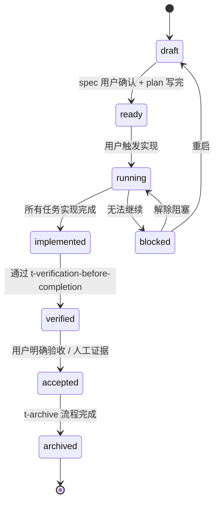

# 基于 Superpowers Fork 的二次开发规划

> 适用场景：已 fork `obra/superpowers`，团队 harness 为 Codex / Cursor / Claude Code。
> 思路：**阶段一只做"机器可见命名与引用迁移"，确保与官方版可独立启停且单装时行为等价；阶段二在迁移完成的命名空间内做能力边界拓展，所有门禁靠 `tools/t-validate` 确定性校验器（含状态转移 API）而非仅靠 prompt 纪律。**

---

## 1. 一句话结论

```text
阶段一不引入任何新入口（new skill）。
直接把 obra/superpowers 的 14 个 skill、4 处必改 manifest 的 name、运行时引用、
hook 内机器可见 skill 标识，加上 t- 前缀整体迁移，让 fork 成为一个独立的、
可与官方插件同时安装的 "t-superpowers" 插件。

阶段一严格限定：只迁移机器可见命名（目录名、4 处 manifest name、内部引用、
hook 读取路径与注入正文中的 skill 标识、Cursor manifest 结构修复、
Codex 兼容 hook）。不动 description / defaultPrompt / 行为塑造文本 /
默认产物路径。

阶段一明确不动的 3 处入口：package.json / gemini-extension.json /
.opencode/plugins/superpowers.js（团队不支持发布到 npm / Gemini / OpenCode）。

阶段二独立分项上线：路径统一 docsDev/、触发收敛（含关键 SKILL frontmatter
description）、状态机、归档闸门、subagent 纪律、harness 元数据收敛。
阶段二唯一新增 skill 入口为 t-archive。
所有门禁靠 tools/t-validate 确定性校验器（state-transition API），
而非仅靠 skill prompt 自述。
```

---

## 2. 真实诉求

### 2.1 认可 Superpowers 的部分

认可的是 Superpowers 的"底层工程纪律"：

- `brainstorming`：先理解上下文、澄清需求、比较方案、明确 trade-off。
- `writing-plans`：把需求变成可执行、可验证、细粒度的实施计划。
- `test-driven-development`：复杂行为变更和 bugfix 采用红绿重构。
- `systematic-debugging`：复杂 bug 先复现、定位根因、验证假设。
- `verification-before-completion`：完成声明必须有新鲜验证证据。
- `subagent-driven-development`：fresh subagent 分任务执行 + 两轮 review。
- `using-git-worktrees` / `requesting-code-review` / `receiving-code-review` / `finishing-a-development-branch`。
- `writing-skills`：把 skill 本身按 TDD 思路迭代。

### 2.2 不认可 Superpowers 默认行为的部分

- **触发太频繁**：通过 `hooks/session-start` 强制注入 `using-superpowers` 全文，倾向"只要像开发任务就自动介入"；同时各 skill SKILL frontmatter 的 `description` 也会让 Codex 隐式触发 brainstorming 等 skill。
- **产物路径不合适**：默认写 `docs/superpowers/specs/...` 和 `docs/superpowers/plans/...`（来自 `skills/brainstorming/SKILL.md`、`skills/writing-plans/SKILL.md`），希望统一到 `docsDev/`。
- **缺少长期规格库**：复杂需求完成后没有沉淀到团队共享规格库的固定路径。

### 2.3 目标用户与使用方式

- 团队规模：约 10 人小开发团队，使用 Codex / Cursor / Claude Code。
- 简单需求：使用 Agent 普通模式或 Agent Plan Mode。
- 复杂需求：使用 fork 的 `t-superpowers` 插件，进入 `t-*` skill 链路。
- 目标：复杂需求质量更高，规格沉淀，且不与官方 superpowers 命名冲突。

---

## 3. 关键事实（基于源码核对）

### 3.1 现有 skill 清单（共 14 个）

```text
skills/brainstorming/
skills/dispatching-parallel-agents/
skills/executing-plans/
skills/finishing-a-development-branch/
skills/receiving-code-review/
skills/requesting-code-review/
skills/subagent-driven-development/
skills/systematic-debugging/
skills/test-driven-development/
skills/using-git-worktrees/
skills/using-superpowers/
skills/verification-before-completion/
skills/writing-plans/
skills/writing-skills/
```

阶段一全部前缀化为 `skills/t-<name>/`。阶段二再新增 `skills/t-archive/` 作为唯一新入口。

### 3.2 触发机制：sessionStart hook + skill description 双通道

- Claude / Cursor 上让 skills 强自动触发的关键是 `hooks/session-start`：会话开始把 `skills/using-superpowers/SKILL.md` 全文注入：
  - Cursor → `additional_context`
  - Claude Code → `hookSpecificOutput.additionalContext`
  - Copilot CLI / 其他 → 顶层 `additionalContext`
- **Codex** 的隐式触发还额外依赖每个 skill 的 `description` 字段匹配（参考 Codex Agent Skills 文档）。仅靠改 bootstrap 与 plugin metadata 无法阻止 `t-brainstorming` 等被 description 直接命中。
- Codex 文档亦提到 `agents/openai.yaml` 的 `policy.allow_implicit_invocation: false`，但**本规划明确不采用**（理由见 §6.2 末尾）。
- 整仓搜索 `allow_implicit_invocation` 仍为零命中——upstream 自身没有用任何 policy 字段做隐式调用控制。

### 3.3 三个 harness 的插件入口与 Codex hook 决策

| Harness | 插件 manifest | hook 文件 | 触发模型说明 |
| --- | --- | --- | --- |
| Cursor | `.cursor-plugin/plugin.json` | `hooks/hooks-cursor.json` → `hooks/session-start` | manifest 中声明了 `agents/`、`commands/`，但仓库当前**没有这两个目录**——阶段一统一占位 `.gitkeep` 修复（§5.4 第 7 条） |
| Claude Code | `.claude-plugin/plugin.json` | `hooks/hooks.json` → `hooks/session-start` | hooks.json 内 command 用 `${CLAUDE_PLUGIN_ROOT}` 变量；Claude 注入此变量；`run-hook.cmd` 自身用 `%~dp0` / `dirname` 自定位，不依赖该变量 |
| Codex CLI / App | `.codex-plugin/plugin.json` | 当前**未声明 hooks 字段** | Codex 官方文档支持插件 `hooks` 字段；省略时可能加载默认 `./hooks/hooks.json`，而后者依赖 `${CLAUDE_PLUGIN_ROOT}` 在 Codex 下不可用。决策见下表 |

#### Codex hook 决策矩阵（阶段一）

> 关键约束（来自 codex GPT-5.5 反馈第 1 条）：如果 official-only 基线在 Codex 中通过默认 hook 注入了 bootstrap，而 fork 选择关闭 hooks，**两者就不再"单装等价"**。所以默认必须采用兼容方案，关闭仅作为 official 也关闭时的对齐方案。

| 选项 | 何时使用 | 实施动作 |
| --- | --- | --- |
| **A. Codex 兼容 hook（默认）** | official-only 基线在 Codex 中会注入 bootstrap | 新增 `hooks/hooks-codex.json`，command 不依赖 `${CLAUDE_PLUGIN_ROOT}`（用相对路径 `./hooks/run-hook.cmd session-start`，`run-hook.cmd` 自身会用 `%~dp0` / `dirname` 自定位）；`.codex-plugin/plugin.json` 显式声明 `hooks: "./hooks/hooks-codex.json"` |
| B. 关闭 Codex hook | 仅当 official-only 基线在 Codex 中**也不注入** bootstrap | `.codex-plugin/plugin.json` 显式声明 `hooks: []`，并在文档中记录"已确认 official 在 Codex 中也无 hook 注入" |

阶段一硬性要求：自检脚本（§5.4 第 9 条）要确认 `hooks` 字段是上述两种 exact value 之一，且 A 选项时文件存在且 grep 不命中 `${CLAUDE_PLUGIN_ROOT}`。

> 备注：Codex hooks 当前可能需要 feature flag 才能启用。阶段一并存测试若发现 Codex 实测无 hook 行为，则记录 official 与 fork 双方均未注入的事实，按选项 B 对齐——而不是默认就关闭。

### 3.4 跨 skill 与 hook 内的运行时引用必须同步改名

当前 14 个 skill 内至少 26 处以 `superpowers:<name>` 形式互相引用。**`hooks/session-start` 第 35 行**注入文本里也硬编码了 `'superpowers:using-superpowers'` 字面串——这是注入到 prompt 中的"机器可见 skill 标识"，不改会引导 agent 回到官方 skill。

阶段一必须做一次有范围限制的批量替换：

```text
superpowers:<name>  →  t-superpowers:t-<name>
```

替换范围（详见 §4.4）：

- 必须替换：`skills/`、`hooks/`（含 `session-start` 注入文本中的运行时 skill 标识）、4 处必改 manifest（见 §3.5）。
- 禁止替换：`vendor/`（upstream 只读副本）、`package.json` / `.opencode/` / `gemini-extension.json`（暂不支持入口）。
- 文档/参考来源：可以保留 upstream 字样作为出处说明，但**不能出现在会被 agent 当作可调用 skill 的运行时指令位置**。

### 3.5 仓库内所有"叫 superpowers"的入口（必改 4 处 + 明确排除 3 处）

阶段一处理范围严格按下表，**不允许扩散**：

#### 必改 4 处

| 入口文件 | 当前 `name` | 影响 harness | 阶段一处置 |
| --- | --- | --- | --- |
| `.claude-plugin/plugin.json` | `superpowers` | Claude Code | 必改 → `t-superpowers` |
| `.cursor-plugin/plugin.json` | `superpowers` | Cursor | 必改 → `t-superpowers` |
| `.codex-plugin/plugin.json` | `superpowers` | Codex CLI / App | 必改 → `t-superpowers`；同时按 §3.3 决策矩阵设置 `hooks` 字段 |
| `.claude-plugin/marketplace.json` | marketplace `superpowers-dev`；`plugins[0].name = superpowers` | Claude Code 插件市场 | 必改：marketplace name → `t-superpowers-dev`；嵌套 plugin name → `t-superpowers` |

#### 明确排除 3 处（阶段一不动；团队不发布到这些目标）

| 入口文件 | 排除原因 | 阶段一约束 |
| --- | --- | --- |
| `package.json`（npm 包） | `package.json:5` 的 `main` 指向 `.opencode/plugins/superpowers.js`；后者第 67 行仍读 `skills/using-superpowers`。如果只改 npm name 而不动 main 与 OpenCode 插件，会留下半迁移状态。团队不支持 OpenCode，所以整体不动 | **字节级保持不动**；自检显式校验 `name` 仍为 `superpowers`（即"未被误改"） |
| `gemini-extension.json` | 团队不支持 Gemini | 同上字节级不动 |
| `.opencode/plugins/superpowers.js` | 团队不支持 OpenCode | 同上字节级不动 |

> 备注：未来若要支持 npm/Gemini/OpenCode 任一目标，必须在该目标启用前完整 t-* 化对应入口（含 `package.json` `name` + `main` + `.opencode/plugins/` 文件名 + 文件内 skill 引用）。本规划阶段一/二都不覆盖此扩展。

### 3.6 仓库根 AGENTS.md 是 symlink

- 实际状态：`AGENTS.md -> CLAUDE.md`（symlink），`CLAUDE.md` 是真实文件。
- 当前 `CLAUDE.md` 是**中文翻译版本**（已被 fork 维护者本地化），不是 upstream 原文。所以"把 CLAUDE.md 字节级复制到 `docs/upstream-contrib.md`"是错的——会把中文翻译当作 upstream 基线。
- 处理办法：`docs/upstream-contrib.md` 必须从 `vendor/superpowers/` 同步的 upstream 原文生成（见 §4.5、§5.3）。

---

## 4. 命名迁移规范

### 4.1 前缀规则

- skill 目录名：`skills/<name>/` → `skills/t-<name>/`，目录内 `SKILL.md` 的 `name` 字段同步改为 `t-<name>`。
- 插件包名：4 处必改 manifest（§3.5）的 `name` 改为 `t-superpowers`；marketplace 名改为 `t-superpowers-dev`；`displayName` / `interface.displayName` 改为 `T-Superpowers`。
- 跨 skill 引用：`superpowers:<x>` → `t-superpowers:t-<x>`（受 §4.4 范围限制，**必须包含 hook 注入文本中的运行时引用**）。
- 阶段一不动的 3 处入口：`package.json` / `gemini-extension.json` / `.opencode/plugins/superpowers.js`。

### 4.2 完整映射表

| upstream skill | 迁移后 |
| --- | --- |
| `brainstorming` | `t-brainstorming` |
| `dispatching-parallel-agents` | `t-dispatching-parallel-agents` |
| `executing-plans` | `t-executing-plans` |
| `finishing-a-development-branch` | `t-finishing-a-development-branch` |
| `receiving-code-review` | `t-receiving-code-review` |
| `requesting-code-review` | `t-requesting-code-review` |
| `subagent-driven-development` | `t-subagent-driven-development` |
| `systematic-debugging` | `t-systematic-debugging` |
| `test-driven-development` | `t-test-driven-development` |
| `using-git-worktrees` | `t-using-git-worktrees` |
| `using-superpowers` | `t-using-superpowers` |
| `verification-before-completion` | `t-verification-before-completion` |
| `writing-plans` | `t-writing-plans` |
| `writing-skills` | `t-writing-skills` |
| **(阶段二新增)** `t-archive` | 阶段二唯一新增 skill 入口 |

### 4.3 upstream 原始副本的处理（采用方案 C，扩展到根级文件）

| 选项 | 描述 | 优点 | 缺点 |
| --- | --- | --- | --- |
| A | 删除 `skills/<original>/` | 仓库最简洁 | 无法行级对照 upstream，仅靠 git log |
| B | 保留 `skills/<original>/` 不动，与 `skills/t-<name>/` 共存 | 行级对照方便 | 文档量翻倍，且对外可能误暴露 |
| C（采用） | upstream 副本移到 `vendor/superpowers/` 作只读参考；4 处必改 manifest 的 `skills` 字段仅指向 `./skills/`（即 `t-*`） | 行级对照 + harness 不暴露 upstream | rebase 时需要先把 upstream 同步到 `vendor/` 再做 t- 适配 |

vendor 目录结构（扩展到根级行为塑造文件）：

```text
vendor/superpowers/
├── UPSTREAM_COMMIT          # 见 §4.5
├── skills/<name>/           # 14 个 upstream skill 副本
├── CLAUDE.md                # upstream 原文（用于 docs/upstream-contrib.md 的事实基线）
├── AGENTS.md                # upstream 原文（若 upstream 不是 symlink，则单独保存）
├── GEMINI.md                # upstream 原文
├── hooks/                   # upstream 原 hook（含 session-start 原版正文）
├── *.plugin/plugin.json     # upstream 原 manifest（用于阶段一 description 不变核对）
└── package.json / .claude-plugin/marketplace.json / gemini-extension.json
                             # 完整 upstream 入口副本（用于 rebase 时基线对照）
```

### 4.4 引用替换范围

| 范围 | 是否替换 `superpowers:<x>` | 说明 |
| --- | --- | --- |
| `skills/`、`hooks/`（含 `session-start` 注入文本的运行时 skill 标识）、4 处必改 manifest（§3.5） | 必须替换 | agent 运行时会读取并当作 skill 调用指令的位置 |
| `vendor/` | 禁止替换 | upstream 只读副本，rebase 自动覆盖 |
| `package.json` / `gemini-extension.json` / `.opencode/plugins/superpowers.js` | 禁止替换（含 name / 内部引用） | 明确排除入口（§3.5） |
| `docs/upstream-contrib.md`、参考来源、历史说明 | 可保留 upstream 字样 | 但不允许放入会被 agent 当作运行时指令的位置 |
| `CLAUDE.md` / `AGENTS.md` / `GEMINI.md` | 阶段一不动（行为塑造文本） | 阶段二再视情况决定是否拆分多 harness 入口 |

### 4.5 vendor 基线机制

`vendor/superpowers/UPSTREAM_COMMIT` 文件，每次 vendor 同步必须更新：

```text
upstream: https://github.com/obra/superpowers
branch: main
commit: <full-sha>
synced_at: 2026-05-08T09:00:00Z
notes: <可选说明，例如 "initial vendoring for t-superpowers fork">
```

要求：

- `commit` 字段必须是 7 位以上十六进制，不允许空。
- vendor 同步必须从该 commit 对应的 upstream 树**完整拉取**（含 skills/、hooks/、CLAUDE.md、AGENTS.md、GEMINI.md、各 manifest），不能只同步 skills/。
- 自检脚本（§5.4 第 6 条）会校验文件存在与 commit 字段格式。
- `docs/upstream-contrib.md` 必须由 `vendor/superpowers/CLAUDE.md` 生成（§5.3、§5.4 第 8 条）。
- 没有这一基线，rebase 时无法判断 `vendor/` 对应的 upstream 版本，diff 与文档生成都会失真。

---

## 5. 阶段一：纯命名迁移（机器可见命名与引用，单装时行为等价）

阶段一目标：**让 fork 成为一个与官方 superpowers 单装时行为等价、但完全独立命名的插件，且与官方版同时安装时插件命名不冲突、可独立启停**。任何"会塑造模型行为"的改动都推迟到阶段二。

### 5.1 工作清单（严格限定为机器可见命名与引用）

```text
1. 把 upstream 当前 commit 对应的 skills/、hooks/、CLAUDE.md、AGENTS.md、
   GEMINI.md、4 处必改 manifest、3 处明确排除入口（package.json /
   gemini-extension.json / .opencode/plugins/superpowers.js）完整复制到
   vendor/superpowers/，并写入 vendor/superpowers/UPSTREAM_COMMIT 基线（§4.5）

2. 将原 skills/<name>/ 重命名为 skills/t-<name>/，并把每个 SKILL.md
   frontmatter 的 name 字段改为 t-<name>
   （注意：不修改任何步骤、规则、Red Flags、description 等行为塑造文本）

3. 受范围限制的全局替换（见 §4.4）：
   - 内部引用 superpowers:<x> → t-superpowers:t-<x>
   - 范围仅限 skills/、hooks/、4 处必改 manifest；禁止改 vendor/ 与 3 处排除入口

4. 修改 4 处必改 manifest 的 name（§3.5 必改表）：
   - 三个 plugin.json：name → "t-superpowers"，displayName /
     interface.displayName → "T-Superpowers"，skills 字段确认仍指向 "./skills/"
   - .claude-plugin/marketplace.json：marketplace name → "t-superpowers-dev"，
     plugins[0].name → "t-superpowers"
   - 不改任何 description / longDescription / defaultPrompt（行为塑造文本，
     推迟到阶段二 §6.7）
   - 阶段一对 package.json / gemini-extension.json / .opencode/plugins/ 字节
     级不改（含 name / 内部引用）

5. 修改 hooks/session-start：
   - 路径替换：${PLUGIN_ROOT}/skills/using-superpowers/SKILL.md
                → ${PLUGIN_ROOT}/skills/t-using-superpowers/SKILL.md
   - 注入文本中的"运行时 skill 标识"必须替换：
       'superpowers:using-superpowers' → 't-superpowers:t-using-superpowers'
   - 注入文本中"You have superpowers."等品牌文案、EXTREMELY_IMPORTANT
     段语义不动（行为塑造文本，推迟到阶段二）

6. Cursor manifest 结构修复：
   .cursor-plugin/plugin.json 声明了 agents/、commands/，但仓库无对应目录。
   阶段一统一创建占位：mkdir -p agents commands && touch agents/.gitkeep commands/.gitkeep
   （取消"经验证可接受"的豁免选项，避免与自检脚本矛盾）

7. 处理 docs/upstream-contrib.md：
   - 从 vendor/superpowers/CLAUDE.md（upstream 原文，已在第 1 步同步）
     字节级复制到 docs/upstream-contrib.md
   - 严禁从仓库根 CLAUDE.md 复制（当前已是中文翻译版，不能作为 upstream 基线）
   - 阶段一不修改 CLAUDE.md / AGENTS.md / GEMINI.md（见 §5.3）

8. Codex hook 兼容性按 §3.3 决策矩阵执行（默认采选项 A）：
   - 默认（选项 A）：新增 hooks/hooks-codex.json，command 改为
     "./hooks/run-hook.cmd session-start"（不依赖 ${CLAUDE_PLUGIN_ROOT}）；
     .codex-plugin/plugin.json 显式声明 hooks: "./hooks/hooks-codex.json"
   - 仅当 official-only 基线在 Codex 中也确认无 hook 注入时（必须有
     transcript 或文档证据），才允许选项 B：hooks: []
   - 不允许"放任默认行为"，也不允许 hooks: null / 缺省

9. 跑 §5.4 自检脚本（tools/t-stage1-check.sh） + §5.5 三 harness 各自验收
```

### 5.2 行为不变约束（明确禁止项）

阶段一禁止做的事情（任一违反即视为污染单装行为等价测试，必须回退）：

- 不修改 4 处必改 manifest 的 `description` / `longDescription` / `defaultPrompt` 等行为塑造字段。
- 不修改 `hooks/session-start` 注入正文中的行为塑造文本（包括 `You have superpowers.` 等品牌串与 EXTREMELY_IMPORTANT 块的语义）；**例外：注入文本中的运行时 skill 标识必须替换**（§5.1 第 5 步）。
- 不修改 `CLAUDE.md` / `AGENTS.md` / `GEMINI.md` 的内容（仅按 §5.3 拆分文件归属）。
- 不修改任何 `SKILL.md` 的"步骤""规则""Red Flags""description" 等行为塑造文本。
- 不改 `using-superpowers` 的 1% skill-first 强约束。
- 不改默认产物路径（仍写 `docs/superpowers/specs|plans`）。
- 不新增/删除 skill（`t-archive` 是阶段二新增，阶段一不能引入）。
- 不新增 router、状态机、archive 闸门。
- 不修改 3 处明确排除入口（`package.json` / `gemini-extension.json` / `.opencode/plugins/superpowers.js`）的任何字节。

### 5.3 仓库根指令文件（AGENTS.md / CLAUDE.md / GEMINI.md）的处理

事实：当前 `AGENTS.md` 是指向 `CLAUDE.md` 的 symlink；`CLAUDE.md` 已被 fork 维护者本地化为中文版，**不是 upstream 原文**。

阶段一处理（仅做物理复制，不动行为塑造文本）：

```text
1. 保留 AGENTS.md -> CLAUDE.md 的 symlink 关系不变
2. 把 vendor/superpowers/CLAUDE.md（upstream 原文，由 §5.1 第 1 步同步）
   字节级复制到 docs/upstream-contrib.md
3. 不修改仓库根 CLAUDE.md / AGENTS.md / GEMINI.md 的任何内容
```

阶段二再决定（不在阶段一做）：

- 是否在 CLAUDE.md 顶部加一个 fork 声明块。
- 是否拆分 Claude / Codex 的指令源（拆分后必须在文档明确"哪个 harness 读哪个文件"）。
- 是否把 `AGENTS.md` 由 symlink 改为独立文件。

### 5.4 阶段一迁移自检脚本（CI 可直接运行）

把以下脚本保存为 `tools/t-stage1-check.sh`，CI 上执行 `bash tools/t-stage1-check.sh`，**任一非零退出即视为迁移未完成**：

```bash
#!/usr/bin/env bash
set -euo pipefail

# 1. skills/ 下不应再有非 t- 前缀的子目录（仅检查目录，避免 .DS_Store 等文件误判）
non_t_dirs=$(find skills -mindepth 1 -maxdepth 1 -type d ! -name 't-*' | head -1)
test -z "${non_t_dirs}" \
  || { echo "FAIL: non-t- skill dirs remain: ${non_t_dirs}"; exit 1; }

# 2. 不应再有 superpowers:<x> 残留引用（vendor/ 与 3 处排除入口都跳过）
if rg -n --glob '!vendor/**' --glob '!package.json' \
        --glob '!gemini-extension.json' --glob '!.opencode/**' \
     "superpowers:(brainstorming|writing-plans|test-driven-development|systematic-debugging|verification-before-completion|subagent-driven-development|using-superpowers|using-git-worktrees|executing-plans|requesting-code-review|receiving-code-review|finishing-a-development-branch|dispatching-parallel-agents|writing-skills|archive)" \
     skills hooks .claude-plugin .cursor-plugin .codex-plugin >/dev/null; then
  echo "FAIL: superpowers:<x> references remain"; exit 1
fi

# 3. 4 处必改 manifest 的字段精确断言（含 marketplace 顶层与嵌套）
python3 - <<'PY' || exit 1
import json, sys

def load(p):
    return json.load(open(p))

def assert_eq(actual, expected, label):
    if actual != expected:
        print(f"FAIL {label}: expected {expected!r}, got {actual!r}", file=sys.stderr)
        sys.exit(1)

c = load('.claude-plugin/plugin.json')
assert_eq(c.get('name'), 't-superpowers', '.claude-plugin/plugin.json name')

cu = load('.cursor-plugin/plugin.json')
assert_eq(cu.get('name'), 't-superpowers', '.cursor-plugin/plugin.json name')

cx = load('.codex-plugin/plugin.json')
assert_eq(cx.get('name'), 't-superpowers', '.codex-plugin/plugin.json name')

m = load('.claude-plugin/marketplace.json')
assert_eq(m.get('name'), 't-superpowers-dev', 'marketplace.json name')
plugins = m.get('plugins') or []
if not plugins:
    print("FAIL marketplace.json: plugins array is empty", file=sys.stderr); sys.exit(1)
assert_eq(plugins[0].get('name'), 't-superpowers', 'marketplace.json plugins[0].name')

# 反向断言：不允许任何 4 处文件残留 superpowers / superpowers-dev 字面值
for path, key, bad_values in [
    ('.claude-plugin/plugin.json', 'name', {'superpowers'}),
    ('.cursor-plugin/plugin.json', 'name', {'superpowers'}),
    ('.codex-plugin/plugin.json', 'name', {'superpowers'}),
    ('.claude-plugin/marketplace.json', 'name', {'superpowers', 'superpowers-dev'}),
]:
    v = load(path).get(key)
    if v in bad_values:
        print(f"FAIL {path} {key}={v!r} not migrated", file=sys.stderr); sys.exit(1)
PY

# 4. hooks/session-start 必须不再读取 skills/using-superpowers/SKILL.md
#    且注入文本中不应再含运行时 skill 标识 'superpowers:using-superpowers'
if rg -n "skills/using-superpowers/SKILL.md|superpowers:using-superpowers" hooks >/dev/null; then
  echo "FAIL: hooks still references upstream using-superpowers (path or runtime id)"; exit 1
fi

# 5. 14 个 t- 目录与 frontmatter name 都已就位
for n in brainstorming dispatching-parallel-agents executing-plans \
         finishing-a-development-branch receiving-code-review \
         requesting-code-review subagent-driven-development \
         systematic-debugging test-driven-development \
         using-git-worktrees using-superpowers \
         verification-before-completion writing-plans writing-skills; do
  f="skills/t-${n}/SKILL.md"
  test -f "${f}" || { echo "FAIL: missing ${f}"; exit 1; }
  rg -n "^name:[[:space:]]+t-${n}[[:space:]]*$" "${f}" >/dev/null \
    || { echo "FAIL: frontmatter name not t-${n} in ${f}"; exit 1; }
done

# 6. vendor 基线存在且 commit 字段合法 + 同步范围完整
test -f vendor/superpowers/UPSTREAM_COMMIT \
  || { echo "FAIL: vendor/superpowers/UPSTREAM_COMMIT missing"; exit 1; }
rg -n "^commit:[[:space:]]+[0-9a-f]{7,40}[[:space:]]*$" vendor/superpowers/UPSTREAM_COMMIT >/dev/null \
  || { echo "FAIL: UPSTREAM_COMMIT commit field invalid"; exit 1; }
for f in vendor/superpowers/CLAUDE.md vendor/superpowers/skills/using-superpowers/SKILL.md \
         vendor/superpowers/hooks/session-start vendor/superpowers/package.json \
         vendor/superpowers/gemini-extension.json; do
  test -f "${f}" || { echo "FAIL: vendor sync missing ${f}"; exit 1; }
done

# 7. Cursor plugin manifest 结构校验：声明的 agents/、commands/ 路径必须存在
#    （阶段一统一创建占位目录，无豁免选项）
python3 - <<'PY' || exit 1
import json, os, sys
m = json.load(open('.cursor-plugin/plugin.json'))
problems = []
for k in ('agents', 'commands'):
    if k in m:
        p = m[k].lstrip('./').rstrip('/')
        if not os.path.isdir(p):
            problems.append(f"{k!r} -> {p!r} not a directory")
if problems:
    print("FAIL Cursor manifest: " + "; ".join(problems), file=sys.stderr)
    sys.exit(1)
PY

# 8. docs/upstream-contrib.md 必须与 vendor 中 upstream 原文字节一致
diff -q vendor/superpowers/CLAUDE.md docs/upstream-contrib.md >/dev/null \
  || { echo "FAIL: docs/upstream-contrib.md must equal vendor/superpowers/CLAUDE.md (upstream baseline)"; exit 1; }

# 9. Codex hook 必须显式选择 §3.3 决策矩阵中的两种 exact value 之一
python3 - <<'PY' || exit 1
import json, sys, os
m = json.load(open('.codex-plugin/plugin.json'))
if 'hooks' not in m:
    print("FAIL .codex-plugin: 'hooks' field must be explicitly set", file=sys.stderr); sys.exit(1)
hooks = m['hooks']
if hooks == []:
    # 选项 B：必须有文档化证据（这里只检查规划文档存在该说明）
    pass
elif hooks == "./hooks/hooks-codex.json":
    # 选项 A：文件必须存在；路径必须以 ./ 开头；内容不依赖 ${CLAUDE_PLUGIN_ROOT}
    p = "hooks/hooks-codex.json"
    if not os.path.isfile(p):
        print("FAIL hooks/hooks-codex.json missing", file=sys.stderr); sys.exit(1)
    body = open(p).read()
    if "${CLAUDE_PLUGIN_ROOT}" in body or "$CLAUDE_PLUGIN_ROOT" in body:
        print("FAIL hooks/hooks-codex.json must not reference CLAUDE_PLUGIN_ROOT", file=sys.stderr); sys.exit(1)
else:
    print(f"FAIL .codex-plugin: hooks={hooks!r} must be either [] or './hooks/hooks-codex.json'",
          file=sys.stderr); sys.exit(1)
PY

# 10. 3 处明确排除入口必须保持原 name = "superpowers"（确认未被误改）
python3 - <<'PY' || exit 1
import json, sys
for p in ('package.json', 'gemini-extension.json'):
    n = json.load(open(p)).get('name')
    if n != 'superpowers':
        print(f"FAIL {p} name={n!r} (expected 'superpowers' — Stage 1 must not touch excluded entry)",
              file=sys.stderr); sys.exit(1)
PY

echo "OK: Stage 1 migration self-check passed"
```

### 5.5 阶段一并存测试（按"等价"vs"共存"两类语义拆分）

> 关键澄清：**单装时的"行为等价"** 与 **同时安装时的"插件互不冲突"** 是两类不同验收。同时安装两个有 SessionStart hook 的插件会双重注入 bootstrap，行为本就不会"等价"。

> 2026-05-11 范围修订：阶段一真实 transcript 硬门槛只覆盖 Claude Code CLI 与 Codex CLI。Cursor.app 与 Codex App transcript 不再作为阶段一完成阻塞项；Cursor 侧保留 manifest 结构静态校验与占位目录要求。Codex CLI co-installed 因当前安装模型限制降级为后续验证项；Codex CLI 的 official-only 与 fork-only 单装行为仍是阶段一硬门槛。

#### 类型 A：official-only（基线）

- 只装官方 `superpowers`，记录基线行为：插件清单、`/skills` 列表、典型输入（`Let's make a react todo list`）下的 transcript 头部 200 字符。
- **特别记录 Codex 行为**：official 在 Codex 中是否注入 bootstrap（决定 §3.3 决策矩阵走 A 还是 B）。

#### 类型 B：fork-only（行为等价验收）

按 Claude Code CLI 与 Codex CLI 各自跑：

- **Claude Code**：只装 fork `t-superpowers`。`hooks/hooks.json` 触发 `hooks/session-start`，注入内容应来自 `skills/t-using-superpowers/SKILL.md`。同样输入 `Let's make a react todo list`，transcript 头部 200 字符与类型 A 等价（除 skill 标识从 `superpowers:using-superpowers` 变为 `t-superpowers:t-using-superpowers` 外，行为塑造段一致）。
- **Cursor**：阶段一不要求真实 transcript；只保留 `.cursor-plugin/plugin.json` manifest 结构校验和占位目录要求。
- **Codex CLI**：只装 fork。
  - 选项 A（默认）：`hooks/hooks-codex.json` 加载并注入 `t-using-superpowers`；transcript 与类型 A 的 Codex 基线等价（除 skill 标识替换外）。
  - 选项 B：official 与 fork 在 Codex 中均无 hook 注入；插件列表显示 `t-superpowers`；显式调用任意 `t-*` skill 可执行；description 隐式触发覆盖率与官方一致。

#### 类型 C：official + fork co-installed（共存验收）

只验"插件命名不冲突、可独立启停"，**不验"行为等价"**：

- 阶段一硬门槛：Claude Code CLI 的插件清单或技能清单同时显示 `superpowers` 与 `t-superpowers` 两个独立条目，包管理器无冲突报错。
- 后续验证项：Codex CLI co-installed 同时显示 `superpowers` 与 `t-superpowers`。若当前安装模型无法同装 fork，记录限制即可，不阻塞阶段一。
- `/skills` 列表能同时看到 `superpowers:*` 与 `t-superpowers:t-*`，互不覆盖。
- 单独禁用任一插件后，另一插件功能不受影响。
- **明确允许**：双重 bootstrap 注入会导致 prompt 上下文翻倍、可能行为异常——这是预期行为，文档与团队 onboarding 中明确"两者择一启用"。

阶段一完成的硬指标：§5.4 自检脚本退出码 0 + 6 个排除文件无 diff + 确定性 targeted tests 通过 + `tests/subagent-driven-dev/run-test.sh t-smoke --plugin-dir /Users/lihuajun/WorkProject/superpowers --timeout 900` 退出码 0 + 类型 A 基线已记录 + 类型 B（Claude Code CLI 与 Codex CLI）+ 类型 C（Claude Code CLI co-installed）通过。`svelte-todo`、`go-fractals` 与 Codex CLI co-installed 保留为后续验证/pressure fixtures，只记录最新结果，不作为阶段一完成阻塞项。

---

## 6. 阶段二：拓展能力边界（每条独立可上线）

阶段二在阶段一已稳定的命名空间内做行为变更。每一项独立完成、独立验证、独立上线。**所有门禁必须有确定性校验器入口**（§6.9），不允许仅靠 skill prompt 自述。

### 6.1 路径统一到 docsDev/

修改对象：`t-brainstorming/SKILL.md`、`t-writing-plans/SKILL.md`、以及任何引用旧路径的 references。

```text
docs/superpowers/specs/YYYY-MM-DD-<topic>-design.md
  → docsDev/changes/<change-id>/spec.md

docs/superpowers/plans/YYYY-MM-DD-<feature-name>.md
  → docsDev/changes/<change-id>/plan.md
```

新增长期规格库与归档根：

```text
docsDev/specs/<capability>/spec.md      # 团队长期共享规格库
docsDev/archive/<change-id>/            # 归档后的 change 完整快照
                                        # （不加二次日期前缀，与 change-id
                                        # 内嵌的 YYYYMMDD 一致即可）
```

#### change-id 命名规范（统一 UTC）

```text
格式：YYYYMMDD-<slug>
  - YYYYMMDD：UTC 日期，必须由 t-brainstorming 在创建目录时通过
              `date -u +%Y%m%d` 或对应 SDK 调用生成；不允许使用本地日期
  - slug：a-z0-9- 组成，长度 3-40 字符
  - 示例：20260508-add-billing-export
```

时间字段统一规则：

- frontmatter 中所有 `at` / `synced_at` / `approved_at` / `merged_at` 字段必须使用 ISO 8601 UTC（如 `2026-05-08T03:21:00Z`）。
- transcript 留档文件名若包含日期，同样使用 UTC。
- 团队若希望改用本地时区，必须由一次独立变更全篇统一切换，不接受局部混用。

#### change-id 冲突规则

- `t-brainstorming` 创建目录时，目录已存在直接报错并提示用户换 slug，不允许自动加后缀。
- `tools/t-validate` 在 archive precheck 时检查 `docsDev/archive/<change-id>/` 与 `docsDev/archive/<change-id>.tmp/` 都不存在（幂等保护，§6.4）。

### 6.2 触发面收敛（双通道：bootstrap + skill description）

阶段一保留了 1% skill-first 强约束。阶段二必须**双通道**收敛：

#### 通道 1：t-using-superpowers 弹性化

```text
原版（保留在 vendor/superpowers/skills/using-superpowers/）：
  "如果有 1% 可能某个 skill 适用，就必须先调用 skill"

t-using-superpowers 弹性版本：
  "明显属于复杂需求（多文件改动、行为变更、bugfix、需求澄清缺失等）时，
   必须使用对应 t-* skill；
   明显属于简单请求（小文案、小样式、问答、调研）时，
   按 harness 默认行为处理，不强制 skill。"
```

#### 通道 2：关键 t-* SKILL frontmatter description 收敛

Codex 的隐式触发依赖 `description`。即使 t-using-superpowers 已经弹性化，Codex 仍可能根据 `t-brainstorming.description` 直接触发 brainstorming。阶段二必须同步收敛 description，让简单请求不命中：

```yaml
# 旧 description（upstream 原文）：
description: Use this before any creative work - creating features,
  building components, adding functionality, or modifying behavior.

# 新 description（收敛版，强调"复杂"边界）：
description: Use ONLY for complex multi-file features, behavior changes,
  or requirements that need clarification before implementation.
  Do NOT use for single-file edits, copy/style/config tweaks, Q&A, or
  pure code reading. The user must signal complexity (or you must verify
  it spans multiple files / introduces new behavior).
```

需要同步收敛 description 的关键 skill：`t-brainstorming`、`t-writing-plans`、`t-test-driven-development`、`t-systematic-debugging`、`t-subagent-driven-development`。

#### 判定指引（写入 t-using-superpowers）

| 场景 | 是否强制 t- skill | 备选 |
| --- | --- | --- |
| 用户明确说"用 t-superpowers" / "走 brainstorming" | 强制 | 直接进入对应 skill |
| 多文件改动 / 行为变更 / 新功能 | 强制 | 至少 t-brainstorming → t-writing-plans |
| 复杂 bugfix（首次出现、根因不明） | 强制 | t-systematic-debugging |
| 单文件文案 / 样式 / 配置改动 | 不强制 | 直接处理 |
| 纯问答 / 纯代码阅读 / 纯调研 | 不强制 | 直接回答 |
| 模糊场景 | **拒绝自动介入**，提示用户显式声明 | "这看起来比较复杂，要走 t-superpowers 完整流程吗？" |

#### Codex 误触发回归测试

§6.8 必须包含一组 Codex 专用的"description 误触发"用例，验证收敛后简单请求不命中。

#### 明确不采用 `policy.allow_implicit_invocation: false`

Codex 官方文档支持 `agents/openai.yaml` 的 `policy.allow_implicit_invocation: false`，但本规划**明确不采用**：

- `allow_implicit_invocation: false` 会同时禁掉"复杂需求的自动触发"，违反 §2.3 中"复杂需求自动走 t-* 流程"的诉求；
- 我们想要"简单不触发、复杂触发"的弹性边界，只能通过 description 的语义收敛实现；
- 阶段二的验证靠 §6.8 的"误触发回归测试 + 复杂请求触发用例"双向覆盖，保证边界落实。

### 6.3 状态机与 acceptance 闸门

#### plan.md frontmatter schema（完整字段示例）

```markdown
---
change_id: 20260508-add-billing-export
status: ready
status_history:
  - { from: draft,    to: ready,    at: "2026-05-08T03:21:00Z", by: "user-confirm-spec" }
  - { from: ready,    to: running,  at: "2026-05-08T03:25:00Z", by: "t-executing-plans" }

# 状态转移所需的辅助字段（按需出现）：
user_confirmation: "spec & plan reviewed and approved"   # ready → running 必填
blocked_reason: null                                     # any → blocked 必填（解除前不清空）
unblocked_reason: null                                   # blocked → running/draft 必填
acceptance_evidence: null                                # verified → accepted 必填
pending_acceptance_evidence: null                        # 离线无法核实时使用，
                                                         # 与 acceptance_evidence 互斥；
                                                         # 状态保持 verified
archive_failure: null                                    # 归档中途失败时由 t-archive 写入；
                                                         # 包含失败步骤、错误、人工恢复指引
---
```

> frontmatter 修改权约束：plan.md 的 frontmatter 仅由 `tools/t-validate` 在状态转移成功时写入；任何手动修改 frontmatter 的行为视为污染（与 §6.5 plan.md 演进策略呼应）。

#### 状态机



转移责任：

| 转移 | 写入者 | 校验器调用 |
| --- | --- | --- |
| draft → ready | t-brainstorming + t-writing-plans | `t-validate <id> --check-transition --from draft --to ready` |
| ready → running | t-executing-plans / t-subagent-driven-development | `--from ready --to running --proposed-frontmatter <patch>`（`user_confirmation` 必填） |
| running → implemented | 上述执行 skill | `--from running --to implemented` |
| running → blocked | 任何执行 skill | `--from running --to blocked --proposed-frontmatter <patch>`（`blocked_reason` 必填） |
| blocked → running | 任何执行 skill | `--from blocked --to running --proposed-frontmatter <patch>`（`unblocked_reason` 必填；plan 与 spec 不变） |
| blocked → draft | 用户/执行 skill | `--from blocked --to draft --proposed-frontmatter <patch>`（`unblocked_reason` 必填；同时记录 spec/plan 是否重写） |
| implemented → verified | t-verification-before-completion | `--from implemented --to verified`（要求新鲜 verification log） |
| verified → accepted | acceptance gate（新增子规则） | `--from verified --to accepted --proposed-frontmatter <patch>`（`acceptance_evidence` 三类之一） |
| accepted → archived | t-archive | `--phase archive-precheck` + 事务化流程（§6.4） |

校验器要求：所有写入 frontmatter 之前必须先调用 `t-validate --check-transition`，**未通过的转移禁止写入**。涉及新增必填字段的转移必须传 `--proposed-frontmatter`。

#### acceptance_evidence 三类形式（严格定义）

不属于这三类的"用户应该是同意了"叙述一律拒绝；离线无法核实时改写 `pending_acceptance_evidence`，状态保持 `verified`，不进入 `accepted`。

```yaml
# 类型 1：会话内显式验收短语（必须可被 validator 从 transcript 核验原文）
acceptance_evidence:
  type: conversation
  phrase: "我验收通过"            # 必须含"验收"或 "accept" 字面串
  at: "2026-05-08T05:00:00Z"
  transcript_path: "docsDev/changes/<id>/transcripts/2026-05-08T05Z.jsonl"
                                  # 必填，相对仓库根；validator 必须能打开该文件
  message_id: "msg_abc123"        # 必填，transcript 内消息 id
  sha256: "<hex>"                 # 必填；validator 计算该消息 raw text 的 sha256，比对
  # 严格要求：
  #   - validator 打不开 transcript_path / 找不到 message_id / sha256 不匹配 → 拒绝
  #   - phrase 必须出现在被定位消息的正文中（含"验收"或 "accept"）
  #   - 团队工作流必须保留 transcript（至少 conversation 验收的那段消息）；
  #     拿不到时只能改用 type=pr / type=ticket，或写 pending_acceptance_evidence

# 类型 2：PR 验收（语义严格）
acceptance_evidence:
  type: pr
  url: "https://github.com/org/repo/pull/123"
  reviewer: "@alice"
  state: approved | merged          # 必填，且只接受这两个值
  approved_at: "2026-05-08T04:55:00Z"   # state=approved 时必填
  merged_at: "2026-05-08T05:10:00Z"     # state=merged 时必填
  # 严格要求：
  #   - PR URL 必须可访问（agent 在线时实际 GET 验证）
  #   - state=approved 必须对应未被 dismiss 的 review
  #   - PR 处于 closed 但 unmerged 状态不算验收
  #   - 仅 PR 创建 / 评论 / "请求 review" 不算验收
  #   - 离线无法核实 → 改写 pending_acceptance_evidence

# 类型 3：工单系统证据
acceptance_evidence:
  type: ticket
  url: "https://jira.example.com/browse/T-456"
  status: "Verified"                # 必须是工单系统中"已验收"语义的状态
  verified_by: "alice"
  verified_at: "2026-05-08T05:00:00Z"
```

`pending_acceptance_evidence` 字段用法（与 acceptance_evidence 互斥）：

```yaml
pending_acceptance_evidence:
  type: pr | conversation | ticket
  url_or_phrase: "..."
  reason: "offline; cannot verify approval state"
  recorded_at: "2026-05-08T05:00:00Z"
# validator 拒绝 status=accepted 时 pending_acceptance_evidence 非空（互斥）；
# 状态必须停留在 verified
```

### 6.4 归档闸门（新增 t-archive skill — 阶段二唯一新增入口）

`t-archive` 是阶段二唯一新增的 skill 入口。归档采用**事务化顺序 + backup/atomic-replace 机制**，不依赖 git checkout 回滚（避免破坏用户未提交改动）。

#### 第一步：校验阶段（任一失败立即停止；原 change 状态保持 accepted）

```text
1. tools/t-validate <change-id> --phase archive-precheck
2. Archive Patch 解析 + 路径规范化校验（见下）
3. 幂等检查：docsDev/archive/<change-id>/ 与 docsDev/archive/<change-id>.tmp/ 都不存在
4. 用户确认 Archive Patch 摘要
```

#### 路径规范化（不能仅检查字符串前缀）

```python
def validate_target(repo_root: Path, raw_target: str) -> Path:
    if raw_target.startswith("/") or raw_target.startswith("~"):
        raise ArchiveError("absolute path forbidden")
    if ".." in Path(raw_target).parts:
        raise ArchiveError("'..' segment forbidden")

    abs_path = (repo_root / raw_target).resolve()         # 解析 symlink
    specs_root = (repo_root / "docsDev/specs").resolve()
    try:
        rel = abs_path.relative_to(specs_root)
    except ValueError:
        raise ArchiveError(f"target {abs_path} escapes docsDev/specs/")
    if rel == Path('.'):
        raise ArchiveError("target must be a file under docsDev/specs/, not the root itself")
    return abs_path
```

校验规则：

- normalize 后必须严格位于 `docsDev/specs/` 子树**之内**（不允许等于根本身）。
- 禁止绝对路径、`..` 段、symlink 逃逸。
- `Action` 必须为 `create | update`，且与目标文件存在性匹配。
- `Target / Action / Requirement / Scenario` 任一缺失，停止。

#### 事务化执行顺序（backup + atomic replace，不依赖 git）

```text
A. 准备目标 spec 的 backup：
   - 若 Action=update：把当前 docsDev/specs/<capability>/spec.md 备份到
     docsDev/archive/<change-id>.tmp/specs-backup/<capability>/spec.md，
     同时记录 sha256 到 .tmp/specs-backup/CHECKSUMS
   - 若 Action=create：在 .tmp/specs-backup/CHECKSUMS 中记录"target absent"
   并发检测：
   - 解析 patch 后，再次读 target spec，比对 sha256 与 backup 是否一致；
     不一致 → 说明并发被改 → 立即停止；不进入下一步

B. 把 patch 应用结果写到临时新文件 docsDev/specs/<capability>/spec.md.new：
   - 不直接覆盖 target，避免半写状态
   - 写完后比对 sha256 与预期一致

C. 把整个 docsDev/changes/<change-id>/ 复制到 docsDev/archive/<change-id>.tmp/
   （不动原 docsDev/changes/<change-id>/）

D. 在 archive 副本（.tmp/ 内）的 plan.md frontmatter 写 status: archived
   并 append status_history（不动原 docsDev/changes/<change-id>/plan.md）

E. 原子提交：
   E1. mv docsDev/specs/<capability>/spec.md.new
       → docsDev/specs/<capability>/spec.md  (原子 rename)
   E2. mv docsDev/archive/<change-id>.tmp/
       → docsDev/archive/<change-id>/        (原子 rename)
   失败：见下"失败处理"

F. 删除原 docsDev/changes/<change-id>/

G. 最终校验：
   - docsDev/specs/<capability>/spec.md sha256 与 B 步预期一致
   - docsDev/archive/<change-id>/plan.md frontmatter status==archived
   - 原 docsDev/changes/<change-id>/ 不再存在
```

失败处理（按步骤分类）：

| 失败位置 | 副作用 | 恢复动作 | 原 change status |
| --- | --- | --- | --- |
| A 备份/并发检测失败 | 无 | 删除 .tmp/（如果已建） | 仍 accepted |
| B 写 .new 失败 | spec.md.new 可能残留 | 删除 spec.md.new + 删除 .tmp/ | 仍 accepted |
| C 复制目录失败 | .tmp/ 部分写入 | 删除 .tmp/ + 删除 spec.md.new | 仍 accepted |
| D 写 frontmatter 失败 | .tmp/ 完整但 status 未写 | 删除 .tmp/ + 删除 spec.md.new | 仍 accepted |
| E1 spec rename 失败 | spec.md 未变；.new 残留 | 删除 spec.md.new + 删除 .tmp/ | 仍 accepted |
| E2 archive rename 失败 | spec 已替换；.tmp/ 仍在 | 用 .tmp/specs-backup/ 恢复原 spec.md（按 backup checksum 验证） + 删除 .tmp/ | 仍 accepted |
| F 删除原目录失败 | archive 与原 change 双份并存 | **不允许 agent 自动重试**；在原 plan.md append `archive_failure` 块（不动 frontmatter），含目录路径 + 错误，提示人工删除 | 仍 accepted |

任一失败时：

- 不得声称 `archived`。
- **原 docsDev/changes/<change-id>/plan.md frontmatter status 永远保持 accepted**。
- 在原 plan.md 末尾 append `archive_failure` 块（不修改 frontmatter），含失败步骤、错误消息、人工恢复指引。
- 不使用 `git checkout` 回滚——所有恢复都基于 backup 文件 + sha256 校验。

#### Archive Patch 模板（写在 spec.md 末尾，归档时由 t-archive 解析执行）

```markdown
## Archive Patch

### <capability>

Target: docsDev/specs/<capability>/spec.md
Action: create | update

#### ADDED Requirements
##### Requirement: <新增行为名称>
系统必须 ...
###### Scenario: <场景名称>
- Given ...
- When ...
- Then ...

#### MODIFIED Requirements
##### Requirement: <已有行为名称>
Replace with:
系统必须 ...
###### Scenario: <场景名称>
- Given ...
- When ...
- Then ...

#### REMOVED Requirements
- Requirement: <要删除的行为名称>
- Reason: <删除原因>

#### RENAMED Requirements
- From: <旧名称>
- To: <新名称>
- Reason: <重命名原因>
```

#### 长期规格库模板（`docsDev/specs/<capability>/spec.md`）

> Change History 统一放在 frontmatter 之后、Overview 之前的顶部位置（与 §6.5 spec.md 的"顶部 Change History 块"约束一致）。

```markdown
---
capability:
owner:
updated_at:
source: t-superpowers
---

# <Capability> Spec

## Change History
- YYYY-MM-DD: archived from docsDev/changes/<change-id>/

## Overview

## Requirements

### Requirement: <行为名称>
系统必须 ...
#### Scenario: <场景名称>
- Given ...
- When ...
- Then ...

## Notes
```

### 6.5 spec / plan 演进策略

- `spec.md`：允许 rewrite 正文，但**顶部**必须维护 `## Change History` 块（位置与 §6.4 长期规格库模板一致），每次重写 append 一条原因。
- `plan.md`：
  - **正文任务区只允许 append**——任务被废弃时不要删除，改为标记 `[ABANDONED]` 并写原因，保留任务 id；执行日志、verification log、discoveries、archive_failure 块都是 append。
  - **frontmatter 仅由 `tools/t-validate` 在状态转移成功时写入**——任何手动修改 frontmatter 视为污染，CI 应在 PR 中检查 frontmatter diff 是否伴随 status_history 新增条目。

### 6.6 subagent dispatch prompt 模板

`t-subagent-driven-development` 的 dispatch 步骤必须用以下三段式 prompt 头注入子任务上下文（不超过 30 行）：

```text
You are a t-superpowers subagent. Inherit these policies (no exceptions):

[PATH POLICY]
- Read/write only under docsDev/changes/<change-id>/ and the source tree.
- NEVER write to docs/superpowers/.
- Final artifacts go to docsDev/changes/<change-id>/{spec.md,plan.md} only.

[TDD POLICY]
- For any behavior change or bugfix: write failing test FIRST, see it fail
  for the right reason, then write minimal code, then see it pass.
- If you wrote production code before a failing test, delete it and restart.

[VERIFICATION POLICY]
- Do NOT claim "done"/"fixed"/"passing" without fresh evidence in this run.
- Append the verification command and its raw output to plan.md
  under "Verification Log" before declaring task complete.

[YOUR TASK]
change_id: <change-id>
task_id: <task-id>
task_classification: mechanical | integration | judgment
spec_excerpt: <relevant spec section>
plan_task: <plan task block, including file paths and expected behavior>
accumulated_discoveries: <bullet list from prior tasks in this change>

Stop and report back when:
- Task completes with verification log appended, OR
- You hit a blocker (do NOT guess; report blocker with reproduction).
```

附加纪律（写入 t-subagent-driven-development）：

- Accumulated Discoveries（每个子任务结束后写入 plan.md "Discoveries" 块）
- Product Audit（在 spec compliance review 之外，新增"对照原始用户意图"的检查）
- Task classification: mechanical | integration | judgment
- 机械任务可跳过第二轮 review
- 同一 change 的 dispatch 串行，跨 change 才允许并发

### 6.7 三个 harness 各自的元数据收敛

| Harness | 收敛动作 |
| --- | --- |
| Cursor | `.cursor-plugin/plugin.json` 的 `description` 改为"复杂需求才介入"语义；阶段一已对 `agents/`、`commands/` 字段做占位修复 |
| Claude Code | `.claude-plugin/plugin.json` 的 `description` 同上；`hooks/session-start` 注入正文中的品牌串与 EXTREMELY_IMPORTANT 段语义可在此阶段调整 |
| Codex CLI / App | `.codex-plugin/plugin.json` 的 `interface.longDescription` 改写；`defaultPrompt` 默认 `I've got an idea for something I'd like to build.` 会诱导自动 brainstorming，需收敛为 `Let me describe a complex change I want to plan with t-superpowers.` 之类显式语义；按 §6.2 通道 2 同步收敛关键 SKILL 的 frontmatter description |

阶段二验证：在每个 harness 上跑一遍"小文案"输入，且 §6.8 文件状态断言均通过。

### 6.8 压力测试用例（阶段二验收依赖 — 每条加文件状态断言）

每条用例三段式：transcript 期望出现 + transcript 不应出现 + 文件系统断言。

| 场景 | 输入 prompt | 期望出现 | 不应出现 | 文件状态断言 | transcript 留档 |
| --- | --- | --- | --- | --- | --- |
| 误触发拦截（bootstrap 通道） | "帮我把按钮文案从'确定'改成'OK'" | "这是简单文案修改，按你当前请求直接处理" | "进入 t-brainstorming"、"docsDev/changes" | `docsDev/changes/` 不存在新建子目录；`docsDev/specs/`、`docsDev/archive/` 无新文件 | `docsDev/skill-tests/regression/trigger-no.md` |
| 误触发拦截（Codex description 通道） | 在 Codex CLI 直接喂"帮我加一个 README 段落"等简单需求 | Codex 不隐式跳到 t-brainstorming；普通文本编辑响应 | `t-brainstorming` 出现在 transcript skill stack | 同上无 docsDev 新增 | `.../trigger-no-codex-desc.md` |
| 显式触发 + spec | "用 t-superpowers，我要做一个 PDF 导出功能" | "已创建 docsDev/changes/<change-id>/spec.md" | "自动进入 plan"（除非用户确认） | `docsDev/changes/<change-id>/spec.md` 存在；`docs/superpowers/` 无新写入 | `.../trigger-yes.md` |
| 继续实现读 plan | "继续实现这个 change" | "读取 docsDev/changes/<change-id>/plan.md"、"按任务 #1 开始"、"verification log" | "我重新规划一下"、跳过 verification | `plan.md` frontmatter `status` 已从 `ready` 推进到 `running`；`status_history` 新增一条 | `.../run.md` |
| 状态转移 validator 拦截 | 在 ready 状态直接尝试进入 verified | "validator 拒绝：from=ready to=verified 不在合法转移集" | "状态已更新" | `plan.md` frontmatter status 未变 | `.../validator-reject.md` |
| blocked 解除 | 从 blocked 回到 running，未提供 unblocked_reason | "validator 拒绝：unblocked_reason 必填" | "状态已更新" | `plan.md` status 仍为 blocked | `.../blocked-no-reason.md` |
| 离线 pending acceptance | "归档这个 change"，但目前离线，PR 状态未知 | "已写入 pending_acceptance_evidence；状态保持 verified；不进入 accepted" | "归档完成"、"已 accepted" | `plan.md` status 仍 verified；`acceptance_evidence` 为 null；`pending_acceptance_evidence` 非空 | `.../pending-acceptance.md` |
| conversation 验收伪造 | acceptance_evidence type=conversation，但 transcript_path 不存在或 sha256 不匹配 | "validator 拒绝：transcript 不可核验" | "已 accepted" | `plan.md` status 仍 verified | `.../conversation-evidence-fake.md` |
| 无验收却归档 | "归档这个 change" | "缺少 acceptance_evidence，t-validate archive-precheck 失败" | "已归档"、"移动到 docsDev/archive" | `docsDev/archive/` 不存在新目录；原 `plan.md` `status` 仍为 verified（或 implemented） | `.../archive-no-acceptance.md` |
| Archive Patch 路径越界 | patch 写 `Target: docs/superpowers/foo/spec.md` 或 `docsDev/specs/../etc/x.md` | "Archive Patch Target 不在 docsDev/specs/ 之内，拒绝" | "已写入" | `docs/superpowers/`、`docsDev/specs/` 之外路径无任何修改 | `.../archive-bad-target.md` |
| Archive Patch Target 等于 specs 根 | patch 写 `Target: docsDev/specs/` | "Archive Patch Target 必须是文件，不能是目录" | "已写入" | `docsDev/specs/` 无新增 | `.../archive-target-is-root.md` |
| Archive Patch 缺 Scenario | patch 缺 Scenario 块 | "Archive Patch 缺 Scenario，拒绝" | "已合并"、"已写入" | `docsDev/specs/` 文件未变；无 archive 目录创建 | `.../archive-no-scenario.md` |
| 归档幂等 | 第二次对同一 change 执行 archive | "目标 archive 目录已存在，拒绝覆盖" | "已归档"（重复操作不应再次成功） | `docsDev/archive/<change-id>/` 内容字节级与首次归档一致；`docsDev/archive/<change-id>.tmp/` 不存在 | `.../archive-idempotent.md` |
| 残留 .tmp 目录 | 上次失败遗留 `docsDev/archive/<change-id>.tmp/`，再次执行 archive | "检测到 .tmp/ 残留，拒绝执行" | "已归档" | 状态与文件无任何修改 | `.../archive-tmp-residue.md` |
| 并发改 spec 拦截 | 归档过程中 target spec 被并发改 | "并发改动检测：target sha256 不匹配，停止" | "已归档" | target spec、archive 目录均无修改；原 plan.md status 仍 accepted | `.../archive-concurrent-modify.md` |
| 归档中途失败（事务化） | 模拟 E2 archive rename 失败 | `archive_failure` 块出现在原 plan.md 末尾 | "归档完成" | 原 `plan.md` `status` 仍 `accepted`；`docsDev/specs/<capability>/spec.md` 用 backup 恢复（sha256 与 A 步备份一致）；`.tmp/` 已清理；`docsDev/archive/<change-id>/` 不存在 | `.../archive-fail-recovery.md` |
| 子 skill 路径泄漏 | t-brainstorming 输出 spec | "spec 已写入 docsDev/changes/<change-id>/spec.md" | "docs/superpowers/specs" | `docs/superpowers/` 无新增；`docsDev/changes/<change-id>/spec.md` 存在 | `.../path-leak.md` |
| 合法归档 | 满足全部门禁 | "归档完成，移动到 docsDev/archive/<change-id>"、"docsDev/specs/<capability>/spec.md 已更新" | "失败"、"拒绝" | `docsDev/specs/<capability>/spec.md` 存在且含 ADDED/MODIFIED 内容（sha256 等于 B 步预期）；`docsDev/archive/<change-id>/plan.md` 存在且 `status: archived`；原 `docsDev/changes/<change-id>/` 不再存在 | `.../archive-ok.md` |

判定：每个用例必须语义匹配"期望出现"、不出现"不应出现"、且文件状态断言全部通过。

### 6.9 确定性校验器 `tools/t-validate`（state-transition API）

阶段二的所有"门禁"不能仅靠 skill prompt 自述，必须由一个可独立调用、退出码语义明确的脚本承担。校验器 API 按"转移"而非"目标阶段"组织，避免阶段化必填项错位。

#### CLI

```text
tools/t-validate <change-id> --check-transition --from <STATE> --to <STATE>
                              [--proposed-frontmatter <yaml-file>]

tools/t-validate <change-id> --phase archive-precheck

tools/t-validate <change-id> --inspect           # 只读：打印当前状态与下一步可走转移
```

`--proposed-frontmatter` 接受"拟写入但还未落盘"的 frontmatter patch（YAML 文件），把新字段注入到当前 frontmatter 副本中再校验；这样不会出现"必填字段尚未写入但校验器已经要求"的悖论。

#### 各 transition 的必填项分层（核心修订）

| 转移 | 必须传 `--proposed-frontmatter` | 校验内容 |
| --- | --- | --- |
| `draft → ready` | 否 | spec.md 存在；plan.md 任务列表非空；frontmatter `change_id` 与目录名一致 |
| `ready → running` | **是** | `user_confirmation` 字段非空；active change 已选定 |
| `running → implemented` | 否 | plan.md 中所有任务标记完成或显式 `[ABANDONED]` |
| `running → blocked` | **是** | `blocked_reason` 字段非空 |
| `blocked → running` | **是** | `unblocked_reason` 字段非空；`blocked_reason` 被清空；spec/plan 未变更 |
| `blocked → draft` | **是** | `unblocked_reason` 字段非空；明确 spec/plan 是否重写 |
| `implemented → verified` | 否 | verification log 存在且包含命令 + 输出（非空，至少一个 `$ <cmd>` 标记） |
| `verified → accepted` | **是** | `acceptance_evidence` 类型与必填字段（按 §6.3 三类）；`pending_acceptance_evidence` 必须为 null（互斥） |
| `any → blocked` | 等同上面 `running → blocked` | `blocked_reason` 必填 |

`--phase archive-precheck` 额外校验：

- `status == accepted`
- Archive Patch 字段齐全 + 路径规范化通过（§6.4）
- `docsDev/archive/<change-id>/` 与 `docsDev/archive/<change-id>.tmp/` 都不存在（幂等 + .tmp 残留）

#### conversation 类 acceptance_evidence 的核验流程

```text
1. 打开 transcript_path，按 message_id 定位消息
2. 取消息 raw text，计算 sha256，与 evidence.sha256 比对
3. 在 raw text 中搜索 phrase 子串
4. 任一失败 → 退出码 4
```

#### 调用约束

- 所有 status 转移前由对应 skill 调用一次 `--check-transition`；失败则不允许写入 frontmatter。
- `t-archive` 必须在第一步调用 `--phase archive-precheck`，退出非零立即停止，并把校验器输出 append 到原 plan.md `archive_failure` 块。
- 校验器使用 Python / Bash 实现均可，但**必须不依赖 skill 自身或 LLM**（否则失去确定性意义）。

#### 退出码

```text
0   全部通过
1   字段缺失或格式错误
2   状态转移非法（不在白名单）
3   该转移所需的字段不满足（例如 verified 需要的 verification log 缺失）
4   acceptance_evidence 不合规（含 conversation 不可核验）
5   archive precheck 路径越界 / 幂等冲突 / .tmp 残留 / 并发被改
其他 内部错误
```

---

## 7. 长期维护节奏（fork 与 upstream 同步）

### 7.1 rebase 节奏

- 每月固定一次 upstream rebase（每月第 1 个工作日）。
- upstream 发布 release 时（看 `RELEASE-NOTES.md`）触发额外评估。
- 安全/缺陷紧急修复 48 小时内拉取。

### 7.2 rebase 流程

```text
1. git fetch upstream && git merge / rebase upstream/main 到 fork dev 分支
2. 同步 vendor 与基线（完整范围）：
   - 用 upstream 最新版本覆盖 vendor/superpowers/{skills/, hooks/, CLAUDE.md,
     AGENTS.md, GEMINI.md, *.plugin/plugin.json, .claude-plugin/marketplace.json,
     package.json, gemini-extension.json}
   - 更新 vendor/superpowers/UPSTREAM_COMMIT 的 commit / synced_at / notes
   - 用 vendor/superpowers/CLAUDE.md 重新生成 docs/upstream-contrib.md
   （这一步只动 vendor/ 与 docs/upstream-contrib.md，不动 t-* 实际发布目录）
3. 对每个有改动的 upstream skill：
   diff vendor/<old> vs vendor/<new>
   决定是否需要把同样改动应用到 skills/t-<name>/
4. 对 hooks/session-start：检查 upstream 是否调整注入正文；若调整，
   同步行为塑造改动到 fork（注意保留运行时 skill 标识为 t-* 形式）
5. 检查 upstream 是否对 3 处明确排除入口（package.json / gemini-extension.json
   / .opencode/plugins/superpowers.js）有改动；只更新 vendor/ 副本，不改根文件
6. 跑 §5.4 自检脚本 + §6.8 回归压力测试集
7. 通过后合并发布
```

### 7.3 变更评估清单

每次 rebase 前对照 upstream `git log`：

- upstream 是否新增 skill？→ 默认不引入，由团队决议是否新增 `t-<name>`。
- upstream 是否修改 `using-superpowers` 行为？→ 高风险，必须人工确认是否影响 t-using-superpowers 的弹性化逻辑。
- upstream 是否改 `hooks/session-start`？→ 高风险，diff 后再合入；阶段二的注入正文修改可能与 upstream diff 冲突。
- upstream 是否改 4 处必改 manifest 字段格式？→ 同步对应 fork 文件的字段结构（不改 name）。
- upstream 是否改 3 处明确排除入口？→ 仅同步到 vendor/，根文件不动。
- upstream 是否改 CLAUDE.md / AGENTS.md / GEMINI.md？→ 仅同步到 vendor/ 与 docs/upstream-contrib.md。
- upstream Codex 插件文档/schema 是否更新？→ 检查 hooks 字段语义、SessionStart 用法、隐式调用规则；可能影响 §3.3 决策矩阵与 §5.1 第 8 步的 Codex hook 选项。

---

## 8. 必须避免的坑

### 8.1 不要只改 skill 目录名，不改 4 处必改 manifest 的 name 字段

`name: "superpowers"` 与官方版冲突，包管理器会拒绝并存安装或覆盖。`.claude-plugin/plugin.json`、`.cursor-plugin/plugin.json`、`.codex-plugin/plugin.json`、`.claude-plugin/marketplace.json` 都要同步改；marketplace name 还要从 `superpowers-dev` 改为 `t-superpowers-dev`。

### 8.2 不要把 package.json / OpenCode 半迁移

阶段一明确把 `package.json` / `gemini-extension.json` / `.opencode/plugins/superpowers.js` 列为"暂不支持入口"，**字节级不改**。`package.json:5` 的 `main` 指向 `.opencode/plugins/superpowers.js`，后者第 67 行还读 `skills/using-superpowers`——只改 npm name 而不动 main 与 OpenCode 插件，会留下半迁移状态。

### 8.3 不要漏改跨 skill 与 hook 内的运行时引用

`superpowers:<x>` 残留会导致：

- 同时安装官方版时，跨 skill 链路跳到官方 skill，行为分裂；
- 只装 fork 时，子 skill 找不到导致 skill 链路断裂。

特别注意 `hooks/session-start` 注入文本中的运行时 skill 标识（不仅是路径变量），§5.4 第 2 / 第 4 条自检必须保留为 CI 检查。

### 8.4 不要在阶段一动行为塑造文本

阶段一一旦混入行为变更（description / longDescription / defaultPrompt / 注入正文行为段 / CLAUDE.md），单装行为等价测试就无法判断"差异是来自迁移本身还是来自行为修改"。所有行为塑造改动推迟到阶段二。

### 8.5 不要忽视 AGENTS.md 是 symlink + CLAUDE.md 已被本地化

`AGENTS.md → CLAUDE.md` 是 symlink；当前 `CLAUDE.md` 已是中文翻译版而非 upstream 原文。直接复制根 CLAUDE.md 到 `docs/upstream-contrib.md` 会污染 upstream 基线。必须从 `vendor/superpowers/CLAUDE.md` 生成。

### 8.6 不要把"并存测试"等同于"行为等价测试"

同时安装官方与 fork 会双重 SessionStart 注入，行为本就不会等价。必须按 §5.5 拆 official-only / fork-only / co-installed 三类。

### 8.7 不要让 Codex hook 关闭破坏单装等价

如果 official-only 基线在 Codex 中通过 hook 注入了 bootstrap，fork 选 `hooks: []` 关闭就不再等价。必须按 §3.3 决策矩阵默认采"Codex 兼容 hook"；只有 official 也无 hook 注入时才允许关闭。

### 8.8 不要假设 Codex 行为可以用 sessionStart 推断

Codex 的隐式触发依赖 description 匹配；hooks 字段对 Codex 行为另算。§3.3 + §5.1 第 8 步 + §6.2 通道 2 必须独立处理 Codex。**特别提醒**：`policy.allow_implicit_invocation: false` 会同时禁掉复杂需求自动触发，违反诉求，明确不采用（§6.2 末尾）。

### 8.9 不要让 archive 路径校验只查前缀

`Target: docsDev/specs/../etc/x.md` 仅查前缀会通过。必须按 §6.4 做 normalize + symlink 解析 + `relative_to` 子树校验，且禁止 target 等于 specs 根。

### 8.10 不要在归档完成前修改原 change 的 frontmatter status

事务化的核心是：归档全部成功之前，原 `docsDev/changes/<change-id>/plan.md` 的 status 永远保持 `accepted`。任何"先把原文件改成 archived 再移动"的实现都可能在中途失败时留下"状态已 archived 但目录还在 changes/"的不一致。

### 8.11 不要用 git checkout 做归档回滚

`git checkout` 会覆盖用户未提交的并发改动。归档失败的恢复必须基于 backup 文件 + sha256 校验 + atomic replace（§6.4）。

### 8.12 不要忘记 vendor 基线 + 完整同步范围

没有 `vendor/superpowers/UPSTREAM_COMMIT` 时，rebase 后无从判断 vendor 对应哪个 upstream 版本。vendor 必须含 skills/、hooks/、CLAUDE.md、AGENTS.md、GEMINI.md、4 处必改 manifest、3 处排除入口等完整范围。

### 8.13 不要忘记 Cursor manifest 字段校验

`.cursor-plugin/plugin.json` 声明的 `agents/`、`commands/` 当前对应目录不存在。阶段一统一占位修复（无豁免选项），§5.4 第 7 条自检保留。

### 8.14 不要直接修改 upstream 副本

`vendor/superpowers/` 是只读参考，rebase 自动覆盖。任何对它的本地改动都会在下次 rebase 时丢失。

### 8.15 不要把 acceptance 写成"agent 自述"

`acceptance_evidence` 必须由 `tools/t-validate` 校验（§6.9）。"用户应该是同意了"叙述一律拒绝。conversation 类必须可被 validator 从 transcript 核验（path + message_id + sha256）。

### 8.16 不要把 pending 当作 acceptance

离线无法核实时只能写入 frontmatter 的独立字段 `pending_acceptance_evidence`，状态保持 `verified`，与 `acceptance_evidence` 互斥。绝不允许写入 `acceptance_evidence` 的 type 列表中。

### 8.17 不要让 validator 校验"目标状态字段"而非"该转移所需字段"

旧 API（按 phase 校验）会在 ready 阶段就要求 verification log。必须用 `--check-transition --from --to` 分层（§6.9），并对涉及新增必填字段的转移强制传 `--proposed-frontmatter`。

### 8.18 不要在 archive 路径里加二次日期前缀

`change-id` 已含 `YYYYMMDD`。`docsDev/archive/<change-id>/` 即可，不要再写 `<YYYYMMDD>-<change-id>` 造成双日期。

### 8.19 不要让 plan.md frontmatter 被手动改

frontmatter 仅由 `tools/t-validate` 在状态转移成功时写入。CI 应在 PR 中检查 frontmatter diff 必须伴随对应的 `status_history` 新增条目（§6.5）。

### 8.20 不要一次性大批量修改所有 skill 的行为

阶段二每条能力变更（路径迁移 / 双通道触发收敛 / 状态机 / 归档 / subagent 模板）独立完成、独立压力测试、独立上线。

---

## 9. DoD

### 9.1 阶段一 DoD

```text
1. tools/t-stage1-check.sh 退出码 0
2. skills/ 下不再有非 t- 前缀的子目录（find -type d 检查）
3. 14 个 t-<name> SKILL.md 全部存在，frontmatter name 字段已改
4. rg 检查无任何 superpowers:<x> 残留引用（vendor/ 与 3 处排除入口除外，含 hooks/）
5. 4 处必改 manifest 的 name 已迁移：plugin.json (×3) + marketplace.json
   （含 marketplace 顶层 name → t-superpowers-dev、plugins[0].name → t-superpowers）；
   description / longDescription / defaultPrompt 未被修改
6. 3 处排除入口字节级未变（package.json / gemini-extension.json /
   .opencode/plugins/superpowers.js）
7. hooks/session-start 已替换：路径 + 注入文本中的运行时 skill 标识
   ('superpowers:using-superpowers' → 't-superpowers:t-using-superpowers')；
   行为塑造文本（"You have superpowers." 等品牌串、EXTREMELY_IMPORTANT
   段语义）未被修改
8. CLAUDE.md / AGENTS.md / GEMINI.md 内容字节级未变
9. docs/upstream-contrib.md 字节级等于 vendor/superpowers/CLAUDE.md
10. vendor/superpowers/UPSTREAM_COMMIT 存在且 commit 字段格式合法；vendor 同步
    范围完整（含 skills/ / hooks/ / CLAUDE.md / 4 处必改 manifest / 3 处排除入口）
11. .cursor-plugin/plugin.json 声明的 agents/、commands/ 目录已占位创建（统一无豁免）
12. .codex-plugin/plugin.json hooks 字段为 §3.3 决策矩阵的两种 exact value 之一；
    选项 A 时 hooks/hooks-codex.json 存在且不依赖 ${CLAUDE_PLUGIN_ROOT}
13. 确定性 targeted tests 通过：brainstorm-server、Claude Code targeted tests；
    环境 blocker 必须记录为 blocker，不能计为通过
14. tests/subagent-driven-dev/run-test.sh t-smoke --plugin-dir
    /Users/lihuajun/WorkProject/superpowers --timeout 900 退出码 0
15. svelte-todo 与 go-fractals 仅作为 pressure fixtures；记录最新退出码与日志，
    不作为阶段一完成阻塞项
16. 三类并存测试通过且 transcript 均已存档：
    official-only 基线（含 Codex hook 行为记录，Claude Code CLI + Codex CLI）/
    fork-only 行为等价（Claude Code CLI + Codex CLI）/
    co-installed 命名不冲突且可独立启停（Claude Code CLI；Codex CLI co-installed 后续验证）
```

### 9.2 阶段二 DoD（按能力分项验收）

```text
[路径] t-brainstorming / t-writing-plans 的产物路径已切换到 docsDev/，
       §6.8 路径泄漏与显式触发用例文件状态断言全部通过
[触发-bootstrap] t-using-superpowers 已弹性化，§6.8 误触发拦截 (bootstrap
       通道) 用例通过
[触发-description] §6.2 通道 2 列出的关键 SKILL frontmatter description 已
       收敛；§6.8 Codex description 误触发用例通过；明确未引入
       allow_implicit_invocation: false
[状态] plan.md frontmatter 持久化 status；状态转移按 §6.3 责任表；
       tools/t-validate --check-transition 接入对应转移；plan.md 正文
       append-only、frontmatter 仅由 validator 写入
[验收] acceptance_evidence 仅接受三类形式之一；conversation 类必须可被
       validator 从 transcript 核验；离线写 pending_acceptance_evidence；
       不合规由 tools/t-validate 拒绝
[blocked] blocked → running / blocked → draft 转移已定义门禁；
       unblocked_reason 必填；§6.8 blocked-no-reason 用例通过
[归档] t-archive 第一步调用 tools/t-validate --phase archive-precheck；
       §6.4 路径规范化、幂等（含 .tmp/）、并发检测、事务化执行
       (A→B→C→D→E1→E2→F→G) + backup/atomic-replace 全部覆盖；
       不依赖 git checkout 回滚；
       §6.8 archive-bad-target / archive-target-is-root / archive-no-scenario
       / archive-idempotent / archive-tmp-residue / archive-concurrent-modify
       / archive-fail-recovery / archive-ok 文件状态断言全部通过；
       原 plan.md 在归档全部成功前 status 永远保持 accepted
[subagent] dispatch 每次注入 §6.6 prompt 模板的三段式头部
[harness] 三个 plugin.json 的 description / defaultPrompt 已收敛；Codex
       defaultPrompt 不再诱导自动 brainstorming
[校验器] tools/t-validate 可独立 CLI 调用；--check-transition 与
       --phase archive-precheck 双 API 退出码语义明确；涉及新增必填字段
       的转移强制要求 --proposed-frontmatter；conversation 核验流程
       覆盖 path + message_id + sha256；不依赖 LLM
```

---

## 10. 风险阻塞

| 风险 | 影响 | 应对 |
| --- | --- | --- |
| 4 处必改 manifest name 漏改（含 marketplace 顶层与嵌套） | 与官方版冲突，无法并存 | §5.4 第 3 条逐字段 exact value 断言纳入 CI |
| 3 处排除入口被误改 | 半迁移状态，OpenCode/Gemini 行为破坏 | §5.4 第 10 条反向断言：`name` 必须仍为 `superpowers` |
| 跨 skill / hook 运行时引用漏改 | 子 skill 链路断裂；fork 引回官方 skill | §5.4 第 2 / 4 条自检纳入 CI（含 vendor 与 3 处排除入口的 glob 排除） |
| 阶段一混入行为变更 | 单装行为等价测试失效 | 阶段一 PR 模板要求逐字段列出"diff 中是否仅含命名替换"；§5.4 第 8 条字节比对 vendor 基线 |
| Cursor manifest 字段对应目录缺失 | Cursor 加载报错或行为不可预期 | §5.4 第 7 条 manifest 校验提前到阶段一，统一占位无豁免 |
| AGENTS.md symlink 被破坏 + CLAUDE.md 当作 upstream 基线 | Claude / Codex 读到不同约束；upstream 基线被中文翻译污染 | §5.3 阶段一不动根文件，仅从 vendor 生成 docs/upstream-contrib.md |
| Codex hook 默认方案破坏单装等价 | official-only 注入而 fork 关闭 → 不等价 | §3.3 决策矩阵默认采选项 A；§5.4 第 9 条 exact value 校验 |
| Codex hook 自检过弱（接受 null/默认值） | hooks 字段误填仍能过 | §5.4 第 9 条改为 `[]` 或 `./hooks/hooks-codex.json` 二选一 + 文件存在 + 不含 ${CLAUDE_PLUGIN_ROOT} |
| 把"co-installed"当作"行为等价" | 验收口径错位 | §5.5 拆三类语义；§8.6 单列坑 |
| Codex description 隐式触发未收敛 / 误用 allow_implicit_invocation | 阶段二完成后 Codex 仍误触发 brainstorming，或全面禁掉自动触发违反诉求 | §6.2 通道 2 + §6.8 Codex description 误触发回归用例；明确不采用 allow_implicit_invocation: false |
| upstream rebase 不同步 vendor 或缺基线 | 后续 diff 对照失真；docs/upstream-contrib.md 失效 | §4.5 + §5.4 第 6 条 + §7.2 第 2 步硬性规定（完整范围含排除入口） |
| acceptance 被 AI 自行声称 | 没真验收就归档 | §6.3 严格三类定义 + §6.9 校验器拒绝 |
| conversation 验收无法核验 | 伪造短语也能通过 | §6.3 conversation 必填 path/message_id/sha256；§6.9 核验流程；§6.8 conversation-evidence-fake 用例 |
| 离线被当作已验收 | 没真核实就推进到 accepted | §6.3 pending_acceptance_evidence 与 acceptance_evidence 互斥；§6.8 pending-acceptance 用例 |
| Archive Patch 路径越界（含 `..` / symlink / target=specs 根） | 污染 docsDev/specs/ 之外目录或写到根 | §6.4 normalize + relative_to + 禁止 == 根；§6.8 archive-bad-target / archive-target-is-root |
| 归档中途失败被声称成功，或原 change status 被提前改 | 状态与文件不一致 | §6.4 事务化 (A→B→C→D→E1→E2→F→G) + 原 plan.md status 在归档全部成功前永保 accepted + §6.8 archive-fail-recovery |
| 归档回滚误伤用户未提交改动 | 用户工作丢失 | §6.4 用 backup + atomic replace，不用 git checkout；§8.11 单列坑 |
| 归档重复执行 / .tmp 残留 | 历史归档被覆盖或残留状态影响新归档 | §6.4 幂等检查覆盖 archive 与 .tmp 目录；§6.8 archive-idempotent / archive-tmp-residue |
| 并发改 spec 被覆盖 | 别人改的内容被归档静默回退 | §6.4 A 步 backup + sha256 + 应用前再次比对；§6.8 archive-concurrent-modify |
| archive 路径双日期前缀 | 目录命名混乱 | §6.1 / §6.4 统一为 docsDev/archive/<change-id>/ |
| PR 验收语义模糊 | dismissed / unmerged 也被当作 accepted | §6.3 type=pr 严格定义 + §6.9 校验器 |
| validator 阶段化必填项错位 | ready/running 阶段就被要求 verification log | §6.9 改为 --check-transition --from --to 分层校验 + 强制 --proposed-frontmatter |
| frontmatter 被手动改 | 状态机绕过 | §6.5 + §8.19 CI 检查 frontmatter diff 必须伴随 status_history 新增 |
| blocked 恢复转移没门禁 | 静默回到 running 丢失阻塞证据 | §6.3 / §6.9 补 blocked → running / blocked → draft 转移；unblocked_reason 必填 |
| subagent 不继承纪律 | 子任务跳过 TDD / 写错路径 | dispatch 必须以 §6.6 模板三段式头部注入 |
| 团队成员在阶段一就期待新行为 | 沟通错位 | 在仓库 README 顶部明确"阶段一仅迁移命名" |

---

## 11. 参考来源

1. Superpowers 官方仓库 README：`https://github.com/obra/superpowers`
2. Superpowers `.codex-plugin/plugin.json`：`https://raw.githubusercontent.com/obra/superpowers/main/.codex-plugin/plugin.json`
3. Superpowers Codex guide：`https://raw.githubusercontent.com/obra/superpowers/main/docs/README.codex.md`
4. Superpowers `using-superpowers`：`https://raw.githubusercontent.com/obra/superpowers/main/skills/using-superpowers/SKILL.md`
5. Superpowers `brainstorming`：`https://raw.githubusercontent.com/obra/superpowers/main/skills/brainstorming/SKILL.md`
6. Superpowers `writing-plans`：`https://raw.githubusercontent.com/obra/superpowers/main/skills/writing-plans/SKILL.md`
7. Superpowers `test-driven-development`：`https://raw.githubusercontent.com/obra/superpowers/main/skills/test-driven-development/SKILL.md`
8. Superpowers `systematic-debugging`：`https://raw.githubusercontent.com/obra/superpowers/main/skills/systematic-debugging/SKILL.md`
9. Superpowers `verification-before-completion`：`https://raw.githubusercontent.com/obra/superpowers/main/skills/verification-before-completion/SKILL.md`
10. Superpowers `subagent-driven-development`：`https://raw.githubusercontent.com/obra/superpowers/main/skills/subagent-driven-development/SKILL.md`
11. Superpowers `writing-skills`：`https://raw.githubusercontent.com/obra/superpowers/main/skills/writing-skills/SKILL.md`
12. Superpowers `hooks/session-start`：本仓库 `hooks/session-start`
13. Codex Build plugins：`https://developers.openai.com/codex/plugins/build`
14. Codex Hooks：`https://developers.openai.com/codex/hooks`
15. Codex Agent Skills：`https://developers.openai.com/codex/skills`
16. Codex AGENTS.md 官方文档：`https://developers.openai.com/codex/guides/agents-md`
