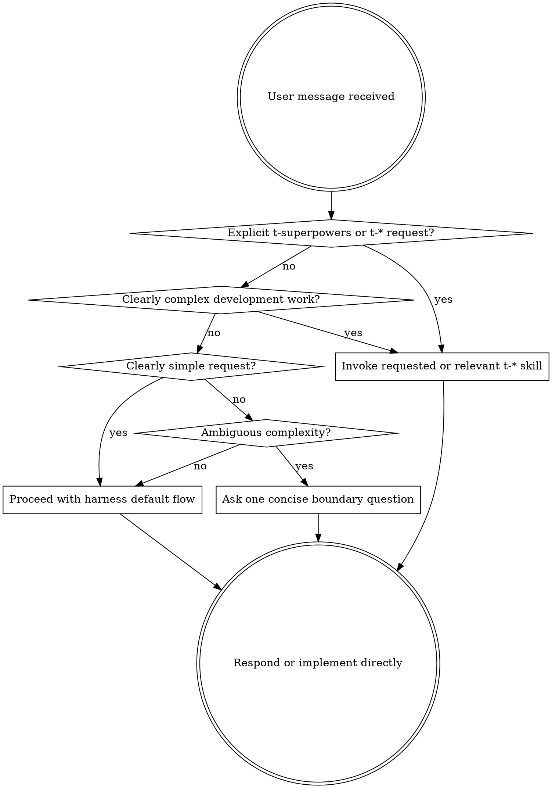

# Trigger Convergence Implementation Plan

> **For agentic workers:** REQUIRED SUB-SKILL: Use t-superpowers:t-subagent-driven-development (recommended) or t-superpowers:t-executing-plans to implement this plan task-by-task. Steps use checkbox (`- [ ]`) syntax for tracking.

**Goal:** Narrow `t-superpowers` trigger behavior so simple requests stay direct while explicit and complex work still enters the relevant `t-*` skill flow.

**Architecture:** This change has two independent trigger channels. `skills/t-using-superpowers/SKILL.md` controls Claude/Cursor bootstrap behavior through injected prompt rules; five frontmatter `description` fields control Codex implicit skill matching. Validation combines deterministic text checks with manual harness transcripts for LLM-dependent behavior.

**Tech Stack:** Markdown skill files, YAML frontmatter, Bash/rg/git validation, Claude Code CLI and Codex CLI manual transcript checks.

---

## File Structure

- `skills/t-using-superpowers/SKILL.md`: rewrite body policy from "1% chance" mandatory skill-first behavior to a trigger-boundary decision table.
- `skills/t-brainstorming/SKILL.md`: narrow frontmatter `description` to complex requirement clarification and multi-file behavior work.
- `skills/t-writing-plans/SKILL.md`: narrow frontmatter `description` to complex approved specs or multi-step requirements.
- `skills/t-test-driven-development/SKILL.md`: narrow frontmatter `description` to complex behavior changes and bugfix implementation.
- `skills/t-systematic-debugging/SKILL.md`: narrow frontmatter `description` to complex bugs, failing tests, and unknown root causes.
- `skills/t-subagent-driven-development/SKILL.md`: narrow frontmatter `description` to executing written plans with independent parallelizable tasks.
- `docs/二开规划/harness-transcripts/trigger-convergence-stage2.md`: create a compact validation record after Claude/Codex prompt checks pass.

## Preconditions

- Current user-owned edits in `CLAUDE.md` and `docs/二开规划/二次开发规划.md` must not be modified by this implementation.
- `bash tools/t-stage1-check.sh` checks `CLAUDE.md` for uncommitted changes. If those user-owned edits are still dirty, final stage-one validation is blocked until the user commits or stashes them.
- Do not modify `vendor/superpowers/`.
- Do not write new runtime artifacts under `docs/superpowers/`.

### Task 1: Baseline The Current Over-Broad Trigger Text

**Files:**
- Read: `skills/t-using-superpowers/SKILL.md`
- Read: `skills/t-brainstorming/SKILL.md`
- Read: `skills/t-writing-plans/SKILL.md`
- Read: `skills/t-test-driven-development/SKILL.md`
- Read: `skills/t-systematic-debugging/SKILL.md`
- Read: `skills/t-subagent-driven-development/SKILL.md`

- [ ] **Step 1: Confirm current dirty files and protect unrelated work**

Run:

```bash
git status --short
```

Expected before implementation in the current workspace:

```text
 M CLAUDE.md
 M "docs/二开规划/二次开发规划.md"
 M docsDev/changes/20260512-trigger-convergence/spec.md
?? docsDev/changes/20260512-trigger-convergence/plan.md
```

If `CLAUDE.md` or `docs/二开规划/二次开发规划.md` are dirty, do not stage or edit them in this change.

- [ ] **Step 2: Capture failing broad-policy checks**

Run:

```bash
rg -n "1% chance|ABSOLUTELY MUST|DO NOT HAVE A CHOICE|Invoke relevant or requested skills BEFORE" skills/t-using-superpowers/SKILL.md
```

Expected before implementation:

```text
skills/t-using-superpowers/SKILL.md:11:If you think there is even a 1% chance a skill might apply to what you are doing, you ABSOLUTELY MUST invoke the skill.
skills/t-using-superpowers/SKILL.md:13:IF A SKILL APPLIES TO YOUR TASK, YOU DO NOT HAVE A CHOICE. YOU MUST USE IT.
skills/t-using-superpowers/SKILL.md:46:**Invoke relevant or requested skills BEFORE any response or action.** Even a 1% chance a skill might apply means that you should invoke the skill to check. If an invoked skill turns out to be wrong for the situation, you don't need to use it.
```

- [ ] **Step 3: Capture failing broad-description checks**

Run:

```bash
rg -n "^description:|any creative work|before any" skills/t-brainstorming/SKILL.md skills/t-writing-plans/SKILL.md skills/t-test-driven-development/SKILL.md skills/t-systematic-debugging/SKILL.md skills/t-subagent-driven-development/SKILL.md
```

Expected before implementation includes these over-broad lines:

```text
skills/t-brainstorming/SKILL.md:3:description: "You MUST use this before any creative work - creating features, building components, adding functionality, or modifying behavior. Explores user intent, requirements and design before implementation."
skills/t-writing-plans/SKILL.md:3:description: Use when you have a spec or requirements for a multi-step task, before touching code
skills/t-test-driven-development/SKILL.md:3:description: Use when implementing any feature or bugfix, before writing implementation code
skills/t-systematic-debugging/SKILL.md:3:description: Use when encountering any bug, test failure, or unexpected behavior, before proposing fixes
skills/t-subagent-driven-development/SKILL.md:3:description: Use when executing implementation plans with independent tasks in the current session
```

### Task 2: Rewrite The Bootstrap Trigger Boundary

**Files:**
- Modify: `skills/t-using-superpowers/SKILL.md`

- [ ] **Step 1: Replace the aggressive top-level gate**

Replace the block from `<EXTREMELY-IMPORTANT>` through `</EXTREMELY-IMPORTANT>` with:

```markdown
<TRIGGER-BOUNDARY>
Use t-* skills when the user explicitly asks for t-superpowers or when the work is clearly complex.

Mandatory t-* skill triggers:
- Explicit user request for `t-superpowers`, a specific `t-*` skill, or a named workflow such as brainstorming, systematic debugging, TDD, subagent-driven development, code review, or finishing a branch.
- Complex multi-file feature work, behavior changes, or requirements that need clarification before implementation.
- Complex bugs, failing tests, unexpected behavior, or root-cause-unknown problems.
- Implementation of complex behavior changes or bugfixes where test-first work is appropriate.
- Execution of a written multi-step plan where independent tasks can be split across agents.

Do not force t-* skills for clearly simple requests:
- Single-file copy, style, config, spelling, formatting, or mechanical edits.
- Pure Q&A, pure code reading, explanations, or local investigation that does not ask for changes.
- User requests that explicitly ask for direct implementation without the full workflow and are low risk.

Ambiguous requests:
- Do not silently enter the full workflow.
- Ask one concise question, such as "这看起来比较复杂，要走 t-brainstorming 吗？", or proceed in direct mode while explicitly stating "按简单请求处理；如需走 t-superpowers 请说明".
</TRIGGER-BOUNDARY>
```

- [ ] **Step 2: Replace the `## The Rule` section**

Replace the current `## The Rule` section and its dot graph, ending immediately before `## Red Flags`, with:

````markdown
## The Rule

Use the smallest process that fits the request.

Invoke a relevant t-* skill before implementation when the user explicitly asks for it or when the work is clearly complex. Do not invoke a skill just because one could theoretically apply to a simple request.


````

- [ ] **Step 3: Replace the `## Red Flags` table**

Replace the current `## Red Flags` section, ending immediately before `## Skill Priority`, with:

```markdown
## Red Flags

These thoughts mean STOP and check the trigger boundary:

| Thought | Reality |
|---------|---------|
| "This is simple, but a skill exists" | Skill existence alone is not enough. Use direct mode for clearly simple requests. |
| "This is complex, but I can skip planning" | Complex multi-file or behavior-changing work needs the relevant t-* workflow. |
| "The user named a skill, but I can summarize from memory" | Explicit skill requests must use the requested skill. |
| "The bug seems obvious" | If the root cause is not proven, use t-systematic-debugging. |
| "I can enter brainstorming just in case" | Ambiguous requests require a boundary question or explicit direct-mode statement. |
| "A description matched, so it must be complex" | Confirm the request is actually complex before continuing with a heavyweight workflow. |
```

- [ ] **Step 4: Verify the old strong gate is gone**

Run:

```bash
rg -n "1% chance|ABSOLUTELY MUST|DO NOT HAVE A CHOICE|Invoke relevant or requested skills BEFORE" skills/t-using-superpowers/SKILL.md
```

Expected after implementation: no output and exit code 1.

### Task 3: Narrow The Five Codex-Visible Descriptions

**Files:**
- Modify: `skills/t-brainstorming/SKILL.md`
- Modify: `skills/t-writing-plans/SKILL.md`
- Modify: `skills/t-test-driven-development/SKILL.md`
- Modify: `skills/t-systematic-debugging/SKILL.md`
- Modify: `skills/t-subagent-driven-development/SKILL.md`

- [ ] **Step 1: Replace `t-brainstorming` description**

In `skills/t-brainstorming/SKILL.md`, replace the existing `description:` line with:

```yaml
description: "Use ONLY for complex multi-file features, behavior changes, or requirements that need clarification before implementation. Do NOT use for single-file edits, copy/style/config tweaks, Q&A, or pure code reading."
```

- [ ] **Step 2: Replace `t-writing-plans` description**

In `skills/t-writing-plans/SKILL.md`, replace the existing `description:` line with:

```yaml
description: "Use ONLY when a complex approved spec or requirements need a multi-step implementation plan before coding. Do NOT use for simple single-file edits, Q&A, or pure code reading."
```

- [ ] **Step 3: Replace `t-test-driven-development` description**

In `skills/t-test-driven-development/SKILL.md`, replace the existing `description:` line with:

```yaml
description: "Use ONLY when implementing complex behavior changes or bugfixes that need test-first work. Do NOT use for copy/style/config tweaks, Q&A, or pure code reading."
```

- [ ] **Step 4: Replace `t-systematic-debugging` description**

In `skills/t-systematic-debugging/SKILL.md`, replace the existing `description:` line with:

```yaml
description: "Use ONLY for complex bugs, failing tests, or unexpected behavior where the root cause is unknown. Do NOT use for simple edits, Q&A, or pure code reading."
```

- [ ] **Step 5: Replace `t-subagent-driven-development` description**

In `skills/t-subagent-driven-development/SKILL.md`, replace the existing `description:` line with:

```yaml
description: "Use ONLY when executing a written implementation plan with independent tasks that benefit from parallel agents. Do NOT use for simple edits, Q&A, or pure code reading."
```

- [ ] **Step 6: Verify all five descriptions are narrow**

Run:

```bash
rg -n "^description:" skills/t-brainstorming/SKILL.md skills/t-writing-plans/SKILL.md skills/t-test-driven-development/SKILL.md skills/t-systematic-debugging/SKILL.md skills/t-subagent-driven-development/SKILL.md
```

Expected after implementation:

```text
skills/t-brainstorming/SKILL.md:3:description: "Use ONLY for complex multi-file features, behavior changes, or requirements that need clarification before implementation. Do NOT use for single-file edits, copy/style/config tweaks, Q&A, or pure code reading."
skills/t-writing-plans/SKILL.md:3:description: "Use ONLY when a complex approved spec or requirements need a multi-step implementation plan before coding. Do NOT use for simple single-file edits, Q&A, or pure code reading."
skills/t-test-driven-development/SKILL.md:3:description: "Use ONLY when implementing complex behavior changes or bugfixes that need test-first work. Do NOT use for copy/style/config tweaks, Q&A, or pure code reading."
skills/t-systematic-debugging/SKILL.md:3:description: "Use ONLY for complex bugs, failing tests, or unexpected behavior where the root cause is unknown. Do NOT use for simple edits, Q&A, or pure code reading."
skills/t-subagent-driven-development/SKILL.md:3:description: "Use ONLY when executing a written implementation plan with independent tasks that benefit from parallel agents. Do NOT use for simple edits, Q&A, or pure code reading."
```

- [ ] **Step 7: Verify broad phrases do not remain in scoped descriptions**

Run:

```bash
rg -n '^description:.*(any creative work|any work|before any)' skills/t-brainstorming/SKILL.md skills/t-writing-plans/SKILL.md skills/t-test-driven-development/SKILL.md skills/t-systematic-debugging/SKILL.md skills/t-subagent-driven-development/SKILL.md
```

Expected after implementation: no output and exit code 1.

### Task 4: Deterministic Repository Validation

**Files:**
- Validate: `skills/t-using-superpowers/SKILL.md`
- Validate: `skills/t-brainstorming/SKILL.md`
- Validate: `skills/t-writing-plans/SKILL.md`
- Validate: `skills/t-test-driven-development/SKILL.md`
- Validate: `skills/t-systematic-debugging/SKILL.md`
- Validate: `skills/t-subagent-driven-development/SKILL.md`

- [ ] **Step 1: Check whitespace errors**

Run:

```bash
git diff --check -- skills/t-using-superpowers/SKILL.md skills/t-brainstorming/SKILL.md skills/t-writing-plans/SKILL.md skills/t-test-driven-development/SKILL.md skills/t-systematic-debugging/SKILL.md skills/t-subagent-driven-development/SKILL.md docsDev/changes/20260512-trigger-convergence/spec.md docsDev/changes/20260512-trigger-convergence/plan.md
```

Expected: no output and exit code 0.

- [ ] **Step 2: Check `allow_implicit_invocation` was not disabled**

Run:

```bash
rg -n "^[[:space:]]*allow_implicit_invocation:[[:space:]]*false" . --glob "!vendor/**"
```

Expected: no output and exit code 1. This deliberately ignores documentation that mentions the forbidden setting as a non-goal.

- [ ] **Step 3: Check no upstream runtime skill ids were introduced**

Run:

```bash
rg -n "superpowers:(brainstorming|writing-plans|test-driven-development|systematic-debugging|subagent-driven-development|using-superpowers)" skills hooks .claude-plugin .cursor-plugin .codex-plugin tests --glob "!vendor/**"
```

Expected: no output and exit code 1.

- [ ] **Step 4: Run stage-one self-check when unrelated dirty files are clean**

Run:

```bash
bash tools/t-stage1-check.sh
```

Expected when `CLAUDE.md` and other excluded files are clean:

```text
OK: Stage 1 migration self-check passed
```

If it fails because `CLAUDE.md` or another excluded file has pre-existing uncommitted edits, record it as blocked by unrelated dirty working tree, not as a trigger-convergence failure.

### Task 5: Manual Harness Validation And Transcript Record

**Files:**
- Create: `docs/二开规划/harness-transcripts/trigger-convergence-stage2.md`
- Create: `docs/二开规划/harness-transcripts/raw/trigger-convergence-claude-simple.jsonl`
- Create: `docs/二开规划/harness-transcripts/raw/trigger-convergence-claude-simple.stderr.log`
- Create: `docs/二开规划/harness-transcripts/raw/trigger-convergence-codex-readme.jsonl`
- Create: `docs/二开规划/harness-transcripts/raw/trigger-convergence-codex-readme.stderr.log`
- Create: `docs/二开规划/harness-transcripts/raw/trigger-convergence-codex-pdf-implicit.jsonl`
- Create: `docs/二开规划/harness-transcripts/raw/trigger-convergence-codex-pdf-implicit.stderr.log`
- Create: `docs/二开规划/harness-transcripts/raw/trigger-convergence-explicit.jsonl`
- Create: `docs/二开规划/harness-transcripts/raw/trigger-convergence-explicit.stderr.log`

- [ ] **Step 1: Create raw transcript directory**

Run:

```bash
mkdir -p docs/二开规划/harness-transcripts/raw
```

Expected: no output and exit code 0.

- [ ] **Step 2: Run simple Claude bootstrap negative check**

Run from a temporary test project and write fixed raw logs:

```bash
claude -p "帮我把按钮文案从'确定'改成'OK'" --plugin-dir /Users/lihuajun/WorkProject/superpowers --output-format stream-json --verbose > docs/二开规划/harness-transcripts/raw/trigger-convergence-claude-simple.jsonl 2> docs/二开规划/harness-transcripts/raw/trigger-convergence-claude-simple.stderr.log
```

Expected observation:

```text
No Skill invocation for t-superpowers:t-brainstorming.
No claim that brainstorming is mandatory.
No new docsDev/changes/ directory beyond docsDev/changes/20260512-trigger-convergence/ is created for this prompt.
```

- [ ] **Step 3: Run simple Codex description negative check**

Run with the fork-only Codex CLI setup pattern from `docs/二开规划/harness-transcripts/type-b-fork-only.md`, using this prompt:

```text
帮我加一个 README 段落
```

Expected observation:

```text
No t-superpowers:t-brainstorming skill stack entry.
Response proceeds as a simple edit or asks for file context without entering brainstorming.
Raw stdout is saved to docs/二开规划/harness-transcripts/raw/trigger-convergence-codex-readme.jsonl.
Raw stderr is saved to docs/二开规划/harness-transcripts/raw/trigger-convergence-codex-readme.stderr.log.
```

- [ ] **Step 4: Run complex Codex description positive check**

Run with the same fork-only Codex CLI setup pattern, using this prompt:

```text
我要做一个支持多种格式的 PDF 导出功能，涉及前端按钮、后端 API 和模板生成
```

Expected observation:

```text
t-superpowers:t-brainstorming is implicitly selected or announced.
The prompt does not contain "t-superpowers".
The response treats this as complex requirement clarification before implementation.
Raw stdout is saved to docs/二开规划/harness-transcripts/raw/trigger-convergence-codex-pdf-implicit.jsonl.
Raw stderr is saved to docs/二开规划/harness-transcripts/raw/trigger-convergence-codex-pdf-implicit.stderr.log.
```

- [ ] **Step 5: Run explicit complex trigger check**

Run either Claude Code CLI or Codex CLI with:

```text
用 t-superpowers，我要做一个 PDF 导出功能
```

Expected observation:

```text
The relevant t-superpowers skill flow starts.
t-superpowers:t-brainstorming appears before implementation work.
Raw stdout is saved to docs/二开规划/harness-transcripts/raw/trigger-convergence-explicit.jsonl.
Raw stderr is saved to docs/二开规划/harness-transcripts/raw/trigger-convergence-explicit.stderr.log.
```

- [ ] **Step 6: Write the transcript summary after all four checks pass**

Create `docs/二开规划/harness-transcripts/trigger-convergence-stage2.md` with this exact content if all four checks pass:

```markdown
# Stage 2 Trigger Convergence Harness Transcript

日期：2026-05-12
插件组合：fork-only `t-superpowers`
范围：触发面收敛第一轮，仅验证 bootstrap 与 Codex description 通道。

## Simple Claude Bootstrap Negative Check

- Prompt: `帮我把按钮文案从'确定'改成'OK'`
- Command: `claude -p "帮我把按钮文案从'确定'改成'OK'" --plugin-dir /Users/lihuajun/WorkProject/superpowers --output-format stream-json --verbose`
- Transcript: `docs/二开规划/harness-transcripts/raw/trigger-convergence-claude-simple.jsonl`
- Stderr: `docs/二开规划/harness-transcripts/raw/trigger-convergence-claude-simple.stderr.log`
- Result: pass
- Observation: `t-superpowers:t-brainstorming` did not run; the agent did not claim brainstorming was mandatory.

## Simple Codex Description Negative Check

- Prompt: `帮我加一个 README 段落`
- Command: fork-only Codex CLI setup pattern from `docs/二开规划/harness-transcripts/type-b-fork-only.md`
- Transcript: `docs/二开规划/harness-transcripts/raw/trigger-convergence-codex-readme.jsonl`
- Stderr: `docs/二开规划/harness-transcripts/raw/trigger-convergence-codex-readme.stderr.log`
- Result: pass
- Observation: `t-superpowers:t-brainstorming` did not appear in the skill stack for the simple README prompt.

## Complex Codex Description Positive Check

- Prompt: `我要做一个支持多种格式的 PDF 导出功能，涉及前端按钮、后端 API 和模板生成`
- Command: fork-only Codex CLI setup pattern from `docs/二开规划/harness-transcripts/type-b-fork-only.md`
- Transcript: `docs/二开规划/harness-transcripts/raw/trigger-convergence-codex-pdf-implicit.jsonl`
- Stderr: `docs/二开规划/harness-transcripts/raw/trigger-convergence-codex-pdf-implicit.stderr.log`
- Result: pass
- Observation: `t-superpowers:t-brainstorming` appeared even though the prompt did not contain `t-superpowers`.

## Explicit Complex Trigger Check

- Prompt: `用 t-superpowers，我要做一个 PDF 导出功能`
- Command: Claude Code CLI or Codex CLI with fork-only `t-superpowers`
- Transcript: `docs/二开规划/harness-transcripts/raw/trigger-convergence-explicit.jsonl`
- Stderr: `docs/二开规划/harness-transcripts/raw/trigger-convergence-explicit.stderr.log`
- Result: pass
- Observation: explicit `t-superpowers` usage entered `t-superpowers:t-brainstorming` before implementation work.

## Conclusion

- Simple requests no longer force `t-brainstorming`.
- Complex implicit Codex requests still trigger `t-brainstorming`.
- Explicit `t-superpowers` requests still trigger the skill flow.
```

If any check fails, do not write the pass summary. Keep the raw logs and report the failed observation instead.

### Task 6: Commit Trigger Convergence Implementation

**Files:**
- Modify: `skills/t-using-superpowers/SKILL.md`
- Modify: `skills/t-brainstorming/SKILL.md`
- Modify: `skills/t-writing-plans/SKILL.md`
- Modify: `skills/t-test-driven-development/SKILL.md`
- Modify: `skills/t-systematic-debugging/SKILL.md`
- Modify: `skills/t-subagent-driven-development/SKILL.md`
- Create: `docs/二开规划/harness-transcripts/trigger-convergence-stage2.md`
- Create: `docs/二开规划/harness-transcripts/raw/trigger-convergence-claude-simple.jsonl`
- Create: `docs/二开规划/harness-transcripts/raw/trigger-convergence-claude-simple.stderr.log`
- Create: `docs/二开规划/harness-transcripts/raw/trigger-convergence-codex-readme.jsonl`
- Create: `docs/二开规划/harness-transcripts/raw/trigger-convergence-codex-readme.stderr.log`
- Create: `docs/二开规划/harness-transcripts/raw/trigger-convergence-codex-pdf-implicit.jsonl`
- Create: `docs/二开规划/harness-transcripts/raw/trigger-convergence-codex-pdf-implicit.stderr.log`
- Create: `docs/二开规划/harness-transcripts/raw/trigger-convergence-explicit.jsonl`
- Create: `docs/二开规划/harness-transcripts/raw/trigger-convergence-explicit.stderr.log`
- Modify: `docsDev/changes/20260512-trigger-convergence/spec.md`
- Create: `docsDev/changes/20260512-trigger-convergence/plan.md`

- [ ] **Step 1: Review final diff scope**

Run:

```bash
git diff --stat
```

Expected changed files for this implementation:

```text
docsDev/changes/20260512-trigger-convergence/spec.md
docsDev/changes/20260512-trigger-convergence/plan.md
docs/二开规划/harness-transcripts/trigger-convergence-stage2.md
docs/二开规划/harness-transcripts/raw/trigger-convergence-claude-simple.jsonl
docs/二开规划/harness-transcripts/raw/trigger-convergence-claude-simple.stderr.log
docs/二开规划/harness-transcripts/raw/trigger-convergence-codex-readme.jsonl
docs/二开规划/harness-transcripts/raw/trigger-convergence-codex-readme.stderr.log
docs/二开规划/harness-transcripts/raw/trigger-convergence-codex-pdf-implicit.jsonl
docs/二开规划/harness-transcripts/raw/trigger-convergence-codex-pdf-implicit.stderr.log
docs/二开规划/harness-transcripts/raw/trigger-convergence-explicit.jsonl
docs/二开规划/harness-transcripts/raw/trigger-convergence-explicit.stderr.log
skills/t-using-superpowers/SKILL.md
skills/t-brainstorming/SKILL.md
skills/t-writing-plans/SKILL.md
skills/t-test-driven-development/SKILL.md
skills/t-systematic-debugging/SKILL.md
skills/t-subagent-driven-development/SKILL.md
```

User-owned `CLAUDE.md` and `docs/二开规划/二次开发规划.md` may appear in the working tree but must not be staged unless the user explicitly asks to include them.

- [ ] **Step 2: Stage only this change's files**

Run:

```bash
git add docsDev/changes/20260512-trigger-convergence/spec.md
git add docsDev/changes/20260512-trigger-convergence/plan.md
git add docs/二开规划/harness-transcripts/trigger-convergence-stage2.md
git add docs/二开规划/harness-transcripts/raw/trigger-convergence-claude-simple.jsonl
git add docs/二开规划/harness-transcripts/raw/trigger-convergence-claude-simple.stderr.log
git add docs/二开规划/harness-transcripts/raw/trigger-convergence-codex-readme.jsonl
git add docs/二开规划/harness-transcripts/raw/trigger-convergence-codex-readme.stderr.log
git add docs/二开规划/harness-transcripts/raw/trigger-convergence-codex-pdf-implicit.jsonl
git add docs/二开规划/harness-transcripts/raw/trigger-convergence-codex-pdf-implicit.stderr.log
git add docs/二开规划/harness-transcripts/raw/trigger-convergence-explicit.jsonl
git add docs/二开规划/harness-transcripts/raw/trigger-convergence-explicit.stderr.log
git add skills/t-using-superpowers/SKILL.md
git add skills/t-brainstorming/SKILL.md
git add skills/t-writing-plans/SKILL.md
git add skills/t-test-driven-development/SKILL.md
git add skills/t-systematic-debugging/SKILL.md
git add skills/t-subagent-driven-development/SKILL.md
```

- [ ] **Step 3: Confirm staged files exclude unrelated docs**

Run:

```bash
git diff --cached --name-only
```

Expected:

```text
docs/二开规划/harness-transcripts/trigger-convergence-stage2.md
docs/二开规划/harness-transcripts/raw/trigger-convergence-claude-simple.jsonl
docs/二开规划/harness-transcripts/raw/trigger-convergence-claude-simple.stderr.log
docs/二开规划/harness-transcripts/raw/trigger-convergence-codex-pdf-implicit.jsonl
docs/二开规划/harness-transcripts/raw/trigger-convergence-codex-pdf-implicit.stderr.log
docs/二开规划/harness-transcripts/raw/trigger-convergence-codex-readme.jsonl
docs/二开规划/harness-transcripts/raw/trigger-convergence-codex-readme.stderr.log
docs/二开规划/harness-transcripts/raw/trigger-convergence-explicit.jsonl
docs/二开规划/harness-transcripts/raw/trigger-convergence-explicit.stderr.log
docsDev/changes/20260512-trigger-convergence/plan.md
docsDev/changes/20260512-trigger-convergence/spec.md
skills/t-brainstorming/SKILL.md
skills/t-subagent-driven-development/SKILL.md
skills/t-systematic-debugging/SKILL.md
skills/t-test-driven-development/SKILL.md
skills/t-using-superpowers/SKILL.md
skills/t-writing-plans/SKILL.md
```

- [ ] **Step 4: Commit after validation passes or blockers are documented**

Run:

```bash
git commit -m "feat: 收敛 t-superpowers 触发边界"
```

Expected: commit succeeds and prints the `t-dev` branch name with the summary `feat: 收敛 t-superpowers 触发边界`.

If `bash tools/t-stage1-check.sh` remains blocked by unrelated dirty `CLAUDE.md`, include that blocker in the final report and do not claim stage-one validation passed.

## Self-Review Checklist

- Spec coverage: Tasks 2 and 3 implement the two trigger channels; Task 5 covers simple negative, Codex negative, Codex positive, and explicit positive checks; Task 4 covers no `allow_implicit_invocation: false` and description regression grep.
- Incomplete-field scan: The transcript summary in Task 5 has fixed file paths and pass observations. If a validation run fails, do not commit that pass summary.
- Scope check: The plan does not implement path migration, `t-archive`, precheck tooling, state fields, acceptance evidence, or subagent dispatch templates.
- Risk check: Stage-one validation may be blocked by unrelated dirty `CLAUDE.md`; this is called out in Preconditions and Task 4.
