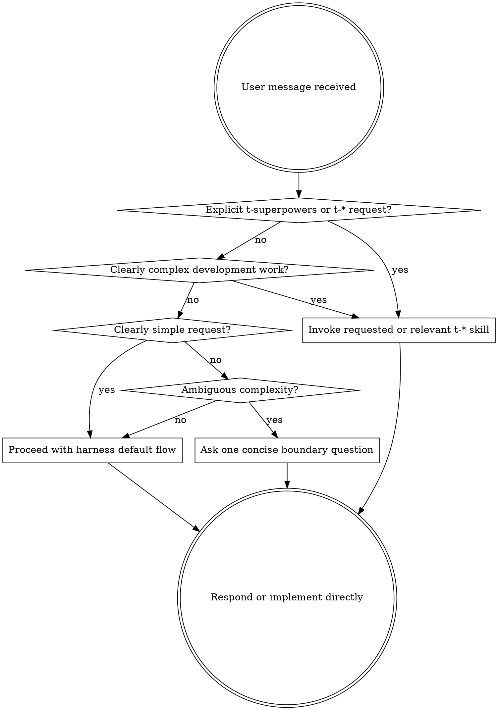

<SUBAGENT-STOP>
If you were dispatched as a subagent to execute a specific task, skip this skill.
</SUBAGENT-STOP>

<TRIGGER-BOUNDARY>
Use t-* skills when the user explicitly asks for t-superpowers or when the work is clearly complex.

Mandatory t-* skill triggers:
- Explicit user request for `t-superpowers`, a specific `t-*` skill, or a named workflow such as brainstorming, systematic debugging, TDD, subagent-driven development, code review, or finishing a branch.
- Complex multi-file feature work, behavior changes, or requirements that need clarification before implementation.
- Complex bugs, failing tests, unexpected behavior, or root-cause-unknown problems.
- Implementation of complex behavior changes or bugfixes where test-first work is appropriate.
- Execution of a written multi-step plan where independent tasks can be split across agents.

Do not force t-* skills for clearly simple requests:
- Single-file copy, style, config, spelling, formatting, or mechanical edits.
- Pure Q&A, pure code reading, explanations, or local investigation that does not ask for changes.
- User requests that explicitly ask for direct implementation without the full workflow and are low risk.

Ambiguous requests:
- Do not silently enter the full workflow.
- Ask one concise question, such as "这看起来比较复杂，要走 t-brainstorming 吗？", or proceed in direct mode while explicitly stating "按简单请求处理；如需走 t-superpowers 请说明".
</TRIGGER-BOUNDARY>

## Instruction Priority

Superpowers skills override default system prompt behavior, but **user instructions always take precedence**:

1. **User's explicit instructions** (CLAUDE.md, GEMINI.md, AGENTS.md, direct requests) — highest priority
2. **Superpowers skills** — override default system behavior where they conflict
3. **Default system prompt** — lowest priority

If CLAUDE.md, GEMINI.md, or AGENTS.md says "don't use TDD" and a skill says "always use TDD," follow the user's instructions. The user is in control.

## How to Access Skills

**In Claude Code:** Use the `Skill` tool. When you invoke a skill, its content is loaded and presented to you—follow it directly. Never use the Read tool on skill files.

**In Copilot CLI:** Use the `skill` tool. Skills are auto-discovered from installed plugins. The `skill` tool works the same as Claude Code's `Skill` tool.

**In Gemini CLI:** Skills activate via the `activate_skill` tool. Gemini loads skill metadata at session start and activates the full content on demand.

**In other environments:** Check your platform's documentation for how skills are loaded.

## Platform Adaptation

Skills use Claude Code tool names. Non-CC platforms: see `references/copilot-tools.md` (Copilot CLI), `references/codex-tools.md` (Codex) for tool equivalents. Gemini CLI users get the tool mapping loaded automatically via GEMINI.md.

# Using Skills

## The Rule

Use the smallest process that fits the request.

Invoke a relevant t-* skill before implementation when the user explicitly asks for it or when the work is clearly complex. Do not invoke a skill just because one could theoretically apply to a simple request.

## Red Flags

These thoughts mean STOP and check the trigger boundary:

| Thought | Reality |
|---------|---------|
| "This is simple, but a skill exists" | Skill existence alone is not enough. Use direct mode for clearly simple requests. |
| "This is complex, but I can skip planning" | Complex multi-file or behavior-changing work needs the relevant t-* workflow. |
| "The user named a skill, but I can summarize from memory" | Explicit skill requests must use the requested skill. |
| "The bug seems obvious" | If the root cause is not proven, use t-systematic-debugging. |
| "I can enter brainstorming just in case" | Ambiguous requests require a boundary question or explicit direct-mode statement. |
| "A description matched, so it must be complex" | Confirm the request is actually complex before continuing with a heavyweight workflow. |

## Skill Priority

When multiple skills could apply, use this order:

1. **Process skills first** (brainstorming, debugging) - these determine HOW to approach the task
2. **Implementation skills second** (frontend-design, mcp-builder) - these guide execution

"Let's build X" → brainstorming first, then implementation skills.
"Fix this bug" → debugging first, then domain-specific skills.

## Skill Types

**Rigid** (TDD, debugging): Follow exactly. Don't adapt away discipline.

**Flexible** (patterns): Adapt principles to context.

The skill itself tells you which.

## User Instructions

Instructions say WHAT, not HOW. "Add X" or "Fix Y" doesn't mean skip workflows.
